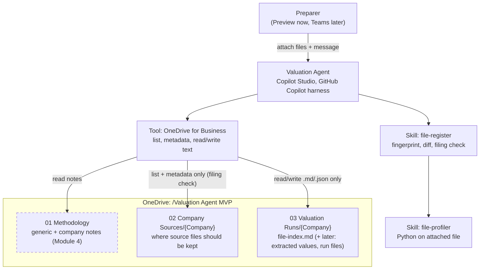
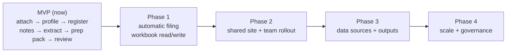

# Company Valuation Agent — MVP Build Record & Phased Expansion Plan

Last updated: 2026-09-24 · Owner: Aria · Platform: Microsoft Copilot Studio (new agent experience / GitHub Copilot harness) · Storage: OneDrive for Business (MVP)

> This is the single source of truth for what is built, how it's configured, and what comes next. Paste-ready configuration text (instructions and skills) is in section 5 — if the agent and this document disagree, update the agent from this document.

---

## 1. Summary

A conversational agent that prepares quarterly portfolio-company valuations. The investment team attaches new files (mostly monthly financials) in chat; the agent works out what each file is, tracks it in a per-company register, extracts what's needed, and at quarter-end builds a review pack and inputs file for one human review before finalizing. The agent does not calculate or approve valuations — the valuation workbook remains the calculator in the MVP.

### Design principles

1. **Minimal effort for the investment team.** Their job: attach files, answer heads-up questions at the start, review once at the end.
2. **Files arrive messy.** No naming or folder rules. The agent inspects every file to decide what it is.
3. **Nothing inferred silently.** Unclear items become open questions; conflicts are flagged, not resolved by the agent.
4. **Future-proof.** Storage location lives in one instruction block; the design moves to a SharePoint/Teams site by swapping one tool and one block of text.
5. **Build modularly.** Each module ends with a checkpoint test before the next starts.

### Methodology hierarchy (lowest → highest priority)

Generic (firm-wide defaults + general best practice, e.g. IPEV Valuation Guidelines) → Company (from 1–2 past workbooks/financials, cited) → Quarter (detected from this quarter's files) → Human (heads-up notes at intake and decisions at review; always wins).

---

## 2. Current architecture



### Why attachments (not OneDrive downloads)

The OneDrive/SharePoint **Get file content** action returns Office files (.xlsx/.docx) as corrupted text in this agent experience — a known platform limitation. Text files (.md, .json, .txt) round-trip correctly. So:

- **Source workbooks enter by chat attachment** (Python opens the real file — verified in Module 2).
- **The agent only writes and reads text files** in OneDrive (register, notes, extracted values).
- **The agent checks and tracks whether each attached file has also been saved** to `02 Company Sources/{Company}` (it can list folders and read file metadata; it cannot reliably upload binaries yet — see Phase 1).

---

## 3. Build status

| Module | Goal | Status | Checkpoint result |
|---|---|---|---|
| 0 | Access check (Copilot Studio, environment, OneDrive) | ✅ Done | Agent created in new experience |
| 1 | Storage foundation (OneDrive folders, test files) | ✅ Done | Folder tree created; SharePoint site not available → OneDrive for MVP |
| 2 | File profiler skill (attachment) | ✅ Done | Opens real .xlsx with Python; found all 49 sheets incl. veryHidden; caught "vf" filename vs "DRAFT" cover conflict; family + upload-suffix stripping works on Opus valuation |
| 3 | OneDrive tool + file register + diff + filing check | 🔄 In progress | Connector download of .xlsx failed (platform limitation) → attachment-first. Test 1 passed: register read (404 = not yet created, expected), hash, profile, register created in OneDrive. Found and fixed: period_end taken from budget columns (would wrongly supersede monthly files), spaces→underscores in uploaded names (breaks filing match), non-standard file_role. Next: tests 2–6 with updated skills |
| 4 | Background load: generic note + company notes | ⏳ Next | — |
| 5 | Extraction skill (monthly values → JSON) | ⏳ | — |
| 6 | Quarter prep: resolve methodology, checks, review pack, inputs file | ⏳ | — |
| 7 | Review & finalize conversation | ⏳ | — |
| 8 | Validation on past quarters | ⏳ | — |

### Housekeeping still to do

- Rename OneDrive folder `02 Company Sources/OceanSite` → `OceanSight` (company names must match everywhere).
- `03 Valuation Runs`: delete `ABC`; create `Opus` and `OceanSight`.
- Before go-live, confirm the production model is approved for confidential portfolio data.
- Opus Q1 valuation is a DRAFT — add the final version if one exists before Module 4.

---

## 4. Storage layout (MVP)

```
OneDrive / Valuation Agent MVP
├── 01 Methodology
│   ├── methodology-generic.md            (Module 4)
│   └── companies/
│       └── methodology-{Company}.md      (Module 4)
├── 02 Company Sources                    team/you keep original files here (flat per company)
│   ├── Opus/
│   └── OceanSight/
└── 03 Valuation Runs                     agent-written text files only
    ├── Opus/
    │   └── file-index.md                 file register (Module 3)
    └── OceanSight/
        └── file-index.md
```

Later modules add, per company: `extracted/{family}_{period}.json` (Module 5) and `{YYYY_Q#}/run-state.md`, `values.json`, `review-pack.md` (Modules 6–7).

---

## 5. Agent configuration (paste-ready)

### 5.1 Build tab settings

| Setting | Value |
|---|---|
| Model | Claude Sonnet 4.6 for build/troubleshooting; planned switch to Claude Opus for production (compare in Evaluate first). No Microsoft-hosted model is offered in this tenant |
| Knowledge | None. "Search all websites" removed. Do **not** add OneDrive as Knowledge (search returns snippets, not whole workbooks) |
| Memory | Off |
| Channels | None yet (Preview only). Teams + Microsoft 365 Copilot at rollout |
| Connected agents | None |

### 5.2 Instructions

```
You are the Company Valuation Agent for a private equity investment team. You help prepare
quarterly valuations of portfolio companies from the files the team provides.

- Files are not consistently named or organized. Work out what each file is by inspecting it.
- Never invent numbers, dates, cell references or file contents. If something is unclear, say so.
- When inspecting spreadsheets, use code to open the actual workbook and read every sheet,
  including hidden sheets.
- Be brief and factual. Use tables for file and sheet summaries.
- You do not calculate or approve valuations.

Storage (MVP): OneDrive for Business, root folder "/Valuation Agent MVP".
- Source files arrive as chat attachments. Never download .xlsx/.docx/.pdf files from OneDrive.
- Original source files should be kept in: /Valuation Agent MVP/02 Company Sources/{Company}/
  You may list this folder and read file metadata to check filing. Never create, rename, move,
  overwrite or delete anything in it.
- Agent-written files (text only: .md and .json): /Valuation Agent MVP/03 Valuation Runs/{Company}/
- Methodology notes: /Valuation Agent MVP/01 Methodology/
- Only read .md and .json files from OneDrive.
If a tool returns a file's content as garbled or partial binary, do not attempt to repair it.
Say the file could not be read and stop.
```

### 5.3 Tool: OneDrive for Business

Selected actions: **List files in folder**, **Get file metadata using path**, **Get file content using path** (text files only), **Create file**, **Update file**. Removed: Get file content (by id).

### 5.4 Skill: `file-profiler`

**Description:** Use when asked to profile, inspect, identify or explain a file from a portfolio company — what type of document it is, what period it covers, whether it is draft or final, and what each sheet contains. Also used by file-register for every new file.

**Instructions:**

````markdown
# File profiler

Profile one attached file so the valuation process can understand it later. Be efficient: one
inventory pass over all sheets, then deep inspection only where it matters.

## Steps
1. Open the attached workbook with Python (openpyxl), once normally and once with
   data_only=True. If you cannot open the real file with code, say so and stop.
2. INVENTORY PASS — in ONE script, for every sheet collect: name, visibility (visible / hidden /
   veryHidden), used range, first ~15 rows of labels, date-like column headers, share of cells
   that are formulas. Classify each sheet from this pass.
3. DEEP PASS — only for sheets classified as income_statement, balance_sheet, cash_flow,
   valuation_summary, comps_or_market_inputs, ebitda_adjustments, pro_forma,
   net_debt_or_equity_bridge, cap_table. For each identify: the entity and its currency;
   column types (actual, budget, forecast, ytd, prior_year, variance, ltm, other); the last
   ACTUAL month.
4. Sheet types (use exactly one): income_statement, balance_sheet, cash_flow, kpis,
   valuation_summary, comps_or_market_inputs, ebitda_adjustments, pro_forma,
   net_debt_or_equity_bridge, cap_table, inputs, calculation, notes, other.
5. Whole-file decisions:
   - file_role (use exactly one): valuation_workbook, monthly_financials_package,
     balance_sheet, cap_table, market_inputs, adjustment_support, pro_forma_support,
     lp_report, other. Put nuance in the purpose/summary, not in file_role.
   - roles_present: every role the file contains.
   - status: final / draft / conflict / unknown. If the file name and content disagree, use
     "conflict" and quote both pieces of evidence. Never pick one.
   - family: file name with dates, years, month codes (e.g. 0126), version words (V2, vf,
     final, draft) and any upload suffix (a dash + 6 or more letters/digits before the
     extension) removed; underscores become spaces; single spaces; Title Case.
     e.g. "2026_Consolidated_Master_File_0126-97289d4c.xlsx" -> "Consolidated Master File".
   - period_end: for monthly packages, the last day of the last ACTUAL month (never a
     budget/forecast column); for valuation workbooks, the valuation date; for balance sheets,
     the balance sheet date. If unclear, leave blank and add an open question.
   - actuals_through, entities (name, currency, sheets), units, currency, company name as
     written in the file.
6. Valuation workbooks only: headline outputs (enterprise value, equity value, fair value of
   the fund's stake, implied multiple) with sheet and cell, and a one-paragraph method
   description.

## Never guess meanings
Do not state what acronyms or unclear sheet names mean (e.g. PB_CACHE, "IC Model", BU, Corp).
Describe what the sheet contains and add an open question listing possible meanings.

## Output
1. Summary table: file role, status (+ evidence), family, period end, actuals through,
   entities, units/currency.
2. Sheet table: name, visibility, type, purpose, entity, periods, column types, inputs/formulas.
3. Open questions.
4. JSON block:

```json
{
  "file_name": "", "family": "", "file_role": "", "roles_present": [],
  "status": "", "status_evidence": [],
  "company_name_in_file": "", "period_end": "", "actuals_through": "",
  "periods_covered": { "from": "", "to": "", "frequency": "" },
  "units": "", "currency": "",
  "entities": [ { "name": "", "currency": "", "sheets": [] } ],
  "sheets": [ { "name": "", "visibility": "", "type": "", "purpose": "", "entity": "",
                "periods": "", "column_types": [], "last_actual": "", "mostly": "" } ],
  "valuation_outputs": [ { "label": "", "sheet": "", "cell": "" } ],
  "valuation_method_summary": "",
  "open_questions": [],
  "confidence": 0
}
```
````

### 5.5 Skill: `file-register` (with filing check)

**Description:** Use whenever a user attaches files for a portfolio company, or asks what files have been received for a company, what's new, what changed, or whether files have been saved to the company folder. Fingerprints and profiles attached files, compares them with the register, checks they are filed in the company folder, and updates the register.

**Instructions:**

````markdown
# File register, diff check and filing check

Register: /Valuation Agent MVP/03 Valuation Runs/{Company}/file-index.md
Company folder (where originals should be kept): /Valuation Agent MVP/02 Company Sources/{Company}/

## Steps
1. Identify the company from the user's message; if unclear, from the company name inside
   the file; if still unclear, ask. Company names are exact: "Opus", "OceanSight".
2. Read file-index.md (OneDrive tool). If it doesn't exist, start an empty register.
3. For each attached file, use Python to compute SHA-256 and size. Strip any upload suffix
   from the name (a dash + 6 or more letters/digits before the extension). Also store a
   normalized_name for matching: lowercase, underscores/hyphens/multiple spaces treated as a
   single space (uploads turn spaces into underscores, so the original name may differ).
4. Diff against the register:
   - Duplicate: same SHA-256 as a registered file. Don't re-profile; say which entry it matches.
   - New: unseen hash. Profile it with the file-profiler skill.
5. For each New file after profiling:
   - New version: another registered file has the same family AND the same non-blank
     period_end. Mark the older one superseded_by the newer. Never supersede across different
     or blank period_ends. Order: final beats draft; higher version (V3 > V2 > none)
     beats lower; otherwise later received_at wins. If either status is "conflict", do not
     supersede — flag it.
   - Structure check: if the family exists, compare the sheet signature (sorted sheet name +
     type) with the most recent file of that family. Record added / removed / type-changed
     sheets; set structure_changed if any.
6. Filing check (for every attached file, New or Duplicate):
   - List the company folder (OneDrive tool). Match on normalized_name (see step 3), not the
     raw name. If found, get its metadata and compare size. If no name matches but a file of
     exactly the same size exists, report it as a possible match.
   - filed_status:
       filed               same name and same size found
       filed_size_differs  same name, different size (possibly a different version)
       possible_match      no name match, but a same-size file exists (name it)
       not_filed           no match
   - Record filed_status, filed_path, filed_checked_at.
   - If not_filed or filed_size_differs, tell the user plainly and give the folder path to
     save it to. Do not try to upload it.
7. Re-check request: if the user says they've saved files, or asks to check filing, re-run the
   filing check for every register entry that is not "filed" and update them.
8. Write the updated register (Create file if new, otherwise Update file).
9. Reply with a table: file, result (New / Duplicate / New version), family, role, period end,
   actuals through, status, supersedes, structure changed, filed status. Then open questions.

## file-index.md format
```
# File register — {Company}
Last updated: {timestamp}

| File | Result | Family | Role | Status | Period end | Actuals through | Superseded by | Structure changed | Filed |
|---|---|---|---|---|---|---|---|---|---|

```json
{
  "company": "",
  "last_updated": "",
  "files": [
    {
      "file_name": "", "normalized_name": "", "sha256": "", "size": 0,
      "received_at": "", "received_from": "",
      "family": "", "file_role": "", "status": "", "status_evidence": [],
      "period_end": "", "actuals_through": "", "entities": [],
      "superseded_by": "", "sheet_signature": [], "structure_changed": false,
      "structure_diff": { "added": [], "removed": [], "type_changed": [] },
      "filed_status": "", "filed_path": "", "filed_checked_at": "",
      "open_questions": [], "extracted": false,
      "profile": {}
    }
  ]
}
```
```

## Rules
- Never delete register entries; superseded files stay, marked.
- The JSON block is the source of truth; the table is for people.
- Write only text files. Never write, upload, move or rename files in 02 Company Sources.
````

---

## 6. Module 3 test plan (current)

Run each in a **new Preview chat**.

| # | Action | Expected |
|---|---|---|
| 1 | Attach `2026 Consolidated Master File_0126.xlsx` → "New file for Opus." | New; profiled; `03 Valuation Runs/Opus/file-index.md` created; filed_status = filed |
| 2 | Attach `…_0226.xlsx` | New; same family; structure_changed = false (unless sheets truly changed); filed |
| 3 | Attach `…_0126.xlsx` again | Duplicate; not re-profiled |
| 4 | Rename a local copy of any Opus file (e.g. `Opus test copy.xlsx`), attach it without saving it to OneDrive | Duplicate (same hash) **and** filed_status = not_filed, with the folder path given |
| 5 | Save that copy into `02 Company Sources/Opus`, then say "I've saved it — recheck filing for Opus" | filed_status updates to filed; then delete the test copy from OneDrive |
| 6 | Open `file-index.md` in OneDrive | Readable table + valid JSON; entries match the tests |

---

## 7. Remaining MVP modules

| Module | Build | Acceptance test |
|---|---|---|
| 4 Background load | Skill: `note-builder` (one skill, two modes: generic and company — keeps the skill count down). You attach 1–2 past valuations + recent financials per company. Generic note = schema + defaults common to the 2 seed companies + IPEV-aligned defaults where silent (no citations). Company note = same schema keys, each item cited (workbook/sheet/cell or financials/page) or marked "inherits generic"; includes a **source map** (where each data item lives, by file family/sheet pattern) and **add-back rules**. Notes saved to `01 Methodology` | A team member reads each company note and confirms the method and add-backs match practice |
| 5 Extraction | Skill: `extract-values`. On each new monthly file (after register): pull the values the source map says, with provenance and confidence; separate actuals from budget; save `extracted/{family}_{period}.json`; set register `extracted = true` | Extracted months match the source files by hand for one company |
| 6 Quarter prep | Skill: `prepare-quarter`. Intake heads-up notes (human layer, scoped quarter/company) → select files from register (latest version per period, actuals only) → merge methodology layers in code → checks (missing months, low confidence, conflicts, stale market inputs, variance vs prior) → `review-pack.md` + downloadable **inputs .xlsx** with a Run Record sheet | Pack for Opus Q1 lists correct files used/ignored and inputs the team agrees with |
| 7 Review & finalize | Skill: `review-and-finalize`. One back-and-forth: questions answered from the pack; changes restated and confirmed with scope; finalize writes status + promotes company-scoped rules to the company note | Change one value and one add-back; finalize; company note shows the standing instruction |
| 8 Validation | Compare prepared inputs against what the team actually used for a completed quarter (only possible where a later quarter exists beyond the workbook used to build the note) | Differences explained by flags or missing heads-up notes |

---

## 8. Phased expansion plan



### Phase 1 — Automatic filing and workbook integration

| Item | Why | Approach / test first |
|---|---|---|
| **Auto-save attachments to the company folder** | Removes the "please also save it" step | Test whether the agent can upload an attached .xlsx to OneDrive without corruption (write a test copy to a `_test` folder, open it in Excel). If the connector corrupts binaries on write too, add a **workflow** tool that receives the attachment and saves it. Register already tracks `filed_status`, so this plugs straight in |
| **Office Scripts library** (read ranges, write inputs, read outputs, write Run Record sheet) | Lets the agent work with workbooks stored in OneDrive/SharePoint, not only attachments; needed to roll forward the valuation workbook | Scripts are saved once (not per workbook) and run on any workbook. Store in a shared location so all users' runs can use them |
| **Workbook roll-forward** | Moves from "inputs file" to "draft valuation workbook" | Copy prior final workbook, write inputs via script, read outputs back, add Run Record sheet |
| **Headline variance checks** (EV, equity value, stake) | Needs workbook outputs | Enabled once outputs are read back |

### Phase 2 — Shared site and team rollout (before your term ends)

| Item | Why | Approach |
|---|---|---|
| **Move storage off your OneDrive** | OneDrive belongs to your account and is locked/deleted after you leave | Move `/Valuation Agent MVP` to a Teams team's Files (SharePoint library) or a site IT provides; swap the OneDrive tool for the SharePoint connector; edit the Storage block in the instructions |
| **Transfer ownership** | Agent, connections and scripts must not depend on your account | New owner/co-owner on the agent; connections under a service or shared account; document in this file |
| **Publish to Teams** for the ~7 users | Real usage | Share with a security group only; confirm everyone may see all companies' data |
| **Concurrency / locking** | Two people working the same company-quarter | Status + "locked by" in run-state or a SharePoint list |
| **Notifications** | "Review pack ready" without checking | Teams message via workflow |
| **Audit list** | Firm-level audit trail beyond version history | SharePoint list of events |

### Phase 3 — Data sources and outputs

| Item | Notes |
|---|---|
| **Market inputs from PitchBook** | MVP: attach a PitchBook comps export. Later: API integration if licensing allows |
| **Acronym / glossary note per company** | Answers to recurring open questions (e.g. what "IC Model" or PB_CACHE means) so the agent stops asking |
| **LP report generation** | From finalized values + methodology |
| **New standard valuation template** | Rebuild formulas into a common structure (not just visual); shared input/output maps |
| **Automatic company-note refresh** | After each finalized quarter, from the final workbook |
| **Misfiled / email-sourced files** | Pull monthlies from a shared inbox or channel instead of manual attachment |

### Phase 4 — Scale and governance

| Item | Notes |
|---|---|
| **Evaluate tab test sets** | Regression tests for profiling, extraction and review packs before any change |
| **Model comparison** | Test profiler/extraction across models in Evaluate |
| **Dataverse or structured store** | If volume, permissions or reporting outgrow text files |
| **Per-company permissions** | If not everyone should see every company's cap table |
| **Cost monitoring** | Monitor tab (after publishing) for credits per run |

### Parking lot (raised, not yet scheduled)

- Monthly cadence: encourage attaching each month as it arrives (faster quarter-end).
- Non-calendar fiscal quarters (if any portfolio company uses one).
- Fund's stake / ownership changes mid-quarter.

---

## 9. Decisions log

| Date | Decision | Why |
|---|---|---|
| 2026-09 | Build in Copilot Studio new agent experience (GitHub Copilot harness) | It's the available experience; skills (Markdown) and Python execution suit messy files |
| 2026-09 | OneDrive for MVP storage | No authority to create a SharePoint site; design keeps migration to one tool + one text block |
| 2026-09 | Agent classifies files itself; no naming/folder rules for the team | Files arrive unlabeled; minimal team effort |
| 2026-09 | Attachments are the input path for source files | Connector download corrupts .xlsx (known platform limitation); attachments verified working |
| 2026-09 | Agent writes/reads text only in OneDrive | Text files round-trip correctly |
| 2026-09 | Filing check + tracking now; auto-save later | Upload of binaries by the agent is unverified; tracking gives visibility meanwhile |
| 2026-09 | No "prior" folders | Prior vs current depends on the quarter being valued; determined from file profiles |
| 2026-09 | Draft/final conflicts flagged, never auto-resolved | e.g. OceanSight "vf" filename with "DRAFT" cover page |
| 2026-09 | Company notes from 1–2 past workbooks/financials + generic inheritance | Limited history; 10 companies to onboard |
| 2026-09 | Notes need no approval; methodology visible in the Run Record at review | Keeps team effort to one review stage |
| 2026-09 | Human input only at intake (heads-up) and one review stage | Team preference |

---

## 10. Known platform constraints

| Constraint | Impact |
|---|---|
| Connector "Get file content" corrupts Office files | Source workbooks must be attached (MVP) |
| Attachments: 16 MiB per file; kept 28 days after last activity | Register keeps profiles/fingerprints permanently; originals must be filed in OneDrive/SharePoint |
| Agent-created files: 10 MB per file | Keep inputs files/review packs small |
| Building, testing and evaluating consume Copilot Credits | Use new chats for tests; stop runaway repair attempts (instruction added) |
| Some features in this experience are preview | Re-check Microsoft docs before each module; UI labels change |
| Model data processing location | Confirm production-model approval for confidential data before go-live |
| Built-in harness file skills (e.g. analyzing-xlsx) | The harness has native Excel/Word/PDF handling. It may run first to open/preprocess a file; our skills then define what to produce. Not a conflict — our skills and instructions govern the output |
| Skill budget per agent (community-reported: about 8) | Planned MVP skills are kept to 6 (note builder merged into one skill) |

---

## 11. Open questions

1. Is the production model (Claude Opus) approved for confidential portfolio data?
2. Does a final (non-draft) Opus Q1 2026 valuation exist?
3. Which Teams team or SharePoint library can host the Phase 2 move?
4. Who takes ownership of the agent after December?
5. What do PB_CACHE and "IC Model" sheets represent (for the glossary note)?
