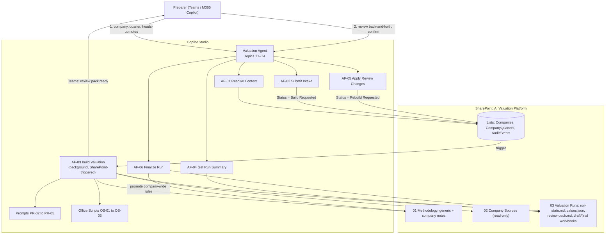
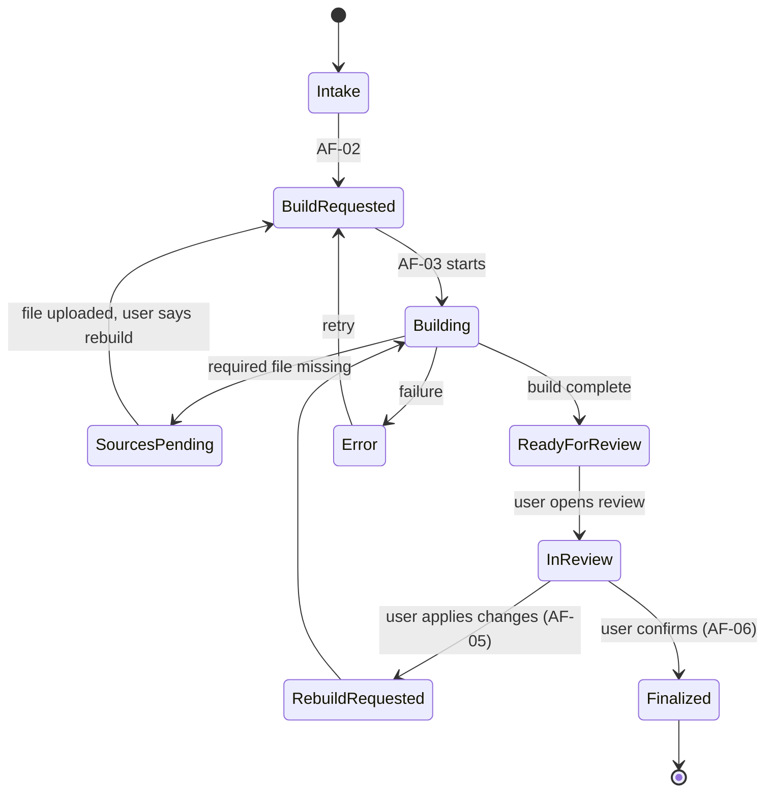

# Company Valuation Agent — Builder Guide (MVP)

Copilot Studio (classic agent + agent flows) · SharePoint system of record · Excel Office Scripts

> **How to use this guide.** Sections 1–2 explain *what* you're building. Sections 3–9 are *build instructions* in the order you'll build them. Section 10 is the logic reference, 11 is the test plan. Microsoft renames menu items often — if a label here doesn't match your screen exactly, search the action picker for the key word (e.g. "prompt", "script", "file content").

---

## 1. Architecture summary

### 1.1 What it does

A preparer opens the **Valuation Agent** in Teams, names a company and quarter, and optionally gives heads-up notes (acquisition, change in calc, one-off items). The system then works unattended: it gathers the quarter's source files, extracts the numbers, resolves the methodology (generic → company → quarter → human), rolls forward the prior workbook, runs checks and writes a review pack. The preparer is notified, reviews in one back-and-forth conversation, and confirms. Finalizing produces the final workbook (with an **AI Run Record** sheet) and carries forward any company-wide rules to the company note.

**Human touchpoints: exactly two** — intake notes at the start, review + confirm at the end. (One exception: if a required source file is missing, the build stops and asks for the file.)

### 1.2 Diagram



Status lifecycle (stored on the CompanyQuarters item):



(In the SharePoint choice column use the spaced names: `Intake`, `Build Requested`, `Building`, `Sources Pending`, `Ready for Review`, `In Review`, `Rebuild Requested`, `Finalized`, `Error`.)

### 1.3 Components

| ID | Component | Type | Called by | Purpose |
|---|---|---|---|---|
| Valuation Agent | Agent | Copilot Studio agent (classic/standard harness) | Users in Teams | The only thing users talk to |
| T1 | Start or resume valuation | Topic | User | Intake + heads-up notes |
| T2 | Check status | Topic | User | Status only |
| T3 | Review valuation | Topic | User / notification | Back-and-forth review |
| T4 | Finalize valuation | Topic | T3 | Confirm and lock |
| AF-00 | Build Company Note | Agent flow (admin tool) | Admin via agent | Creates/refreshes a company methodology note |
| AF-01 | Resolve Context | Agent flow (tool) | T1–T4 | Company + quarter lookup, create record, lock |
| AF-02 | Submit Intake | Agent flow (tool) | T1 | Writes run-state.md, requests build |
| AF-03 | Build Valuation | Agent flow (SharePoint trigger) | Status change | The whole unattended pipeline |
| AF-04 | Get Run Summary | Agent flow (tool) | T1–T4 | Returns status + review pack summary |
| AF-05 | Apply Review Changes | Agent flow (tool) | T3 | Records decisions, requests rebuild |
| AF-06 | Finalize Run | Agent flow (tool) | T4 | Final workbook, record sheet, note promotion |
| PR-00 | Derive Generic Note | Prompt (run once, manually) | You | Generic schema from 2 seed companies |
| PR-01 | Build Company Note | Prompt | AF-00 | Company values against schema, with citations |
| PR-02 | Parse Human Input | Prompt | T1, T3 | Turns free text into structured notes/decisions |
| PR-03 | Extract Source Values | Prompt (code interpreter) | AF-03 | Numbers out of each source file |
| PR-04 | Quarter Scan | Prompt (code interpreter) | AF-03 | Add-backs + quarter-specific treatments |
| PR-05 | Validate & Review Pack | Prompt (code interpreter) | AF-03 | Checks + review-pack.md |
| OS-01 | WriteInputs | Office Script | AF-03 | Writes inputs/overrides/adjustments into workbook |
| OS-02 | ReadOutputs | Office Script | AF-03 | Reads calculated results back |
| OS-03 | WriteRunRecord | Office Script | AF-03, AF-06 | Builds the AI Run Record sheet |

### 1.4 Key design decisions

1. **One conversational agent; all other AI is single prompts inside flows.** Prompts return JSON, are cheaper, and are easier to test than agent-to-agent handoffs.
2. **Build runs in the background.** Triggered by a status change on the CompanyQuarters item, so it avoids the ~100-second agent-tool limit and the same flow handles first builds and rebuilds.
3. **Methodology lives in markdown notes with a JSON block.** Humans read the prose; flows parse the JSON block. Generic note = the schema. Company note = values for the same keys, with citations.
4. **Hierarchy (low → high): generic → company → quarter → human.** Human always wins. Human input is scoped *quarter* (default) or *company* (carried forward).
5. **Numbers and process state are separate files.** `values.json` = numbers. `run-state.md` = what happened (notes, inventory, methodology, flags, decisions).
6. **Nothing is inferred silently.** Add-backs that match an existing company rule with evidence are applied; anything new is *proposed* and only applied if the human accepts it at review.
7. **Rebuilds reuse extracted values** unless source files changed — so review changes never shuffle unrelated numbers.
8. **The workbook is the calculator.** The prior final workbook is copied and rolled forward; its formulas produce the valuation. A nicer template later means rebuilding formulas, not just visuals.
9. **Flows run under one service connection;** access is controlled by who can use the agent and the SharePoint site (7 known users). See §4.4.

### 1.5 In / out of MVP

| In MVP | Later |
|---|---|
| Folder-based file classification | AI classification of misfiled documents |
| Market inputs from an uploaded export (e.g. PitchBook comps export) in `Market Inputs/` | Direct PitchBook API connector |
| Flags live in run-state + review pack | ReviewQueue list and reviewer assignment |
| One confirm step by the preparer | Separate reviewer approval |
| Rolled-forward source workbook | New standard template + LP report generation |
| Manual refresh of company note (AF-00) | Automatic refresh on schedule |

---

## 2. Data model

### 2.1 Methodology layers

| Layer | Rank | Where it lives | Written by | Scope |
|---|---|---|---|---|
| Generic | 1 | `methodology-generic.md` | You (PR-00, once) | All companies |
| Company | 2 | `methodology-{CompanyID}.md` | AF-00 (PR-01) | One company, all quarters |
| Quarter | 3 | `run-state.md` → `quarter_items` | AF-03 (PR-04) | This quarter only |
| Human – company | 4 | Company note → `standing_instructions` (promoted at finalize) and run-state → `human_items` | Preparer | This + future quarters |
| Human – quarter | 5 | `run-state.md` → `human_items` | Preparer | This quarter only |

Within the same rank, the **newest human item wins**. Two different *non-human* values for the same key at the same rank = **conflict flag** (not auto-resolved).

### 2.2 The schema (keys)

The generic note defines every allowed key. Suggested starting set — adjust once you've looked at the 2 seed workbooks:

| Key | Meaning | Example value |
|---|---|---|
| `valuation.primary_method` | Main method | `"EV/EBITDA market multiple"` |
| `valuation.secondary_methods` | Cross-checks | `["recent transaction", "calibration to entry"]` |
| `metric.basis` | LTM / NTM / run-rate | `"LTM"` |
| `metric.units` | Reporting units | `"CAD thousands"` |
| `multiple.source` | Where multiples come from | `"PitchBook comps export"` |
| `multiple.selection_rule` | How chosen | `"median of comps set"` |
| `multiple.discount_premium_pct` | Size/liquidity adj. | `-15` |
| `adjustments.policy` | General add-back rule | `"only with documentary evidence"` |
| `pro_forma.active` | Include acquisitions pro forma | `false` |
| `pro_forma.policy` | How pro forma is built | `"annualize acquired LTM EBITDA from close date"` |
| `net_debt.definition` | Items in net debt | `["term loan","revolver","leases"]` |
| `equity_bridge.items` | EV → equity items | `["net debt","preferred"]` |
| `ownership.basis` | Stake basis | `"fully diluted per cap table"` |
| `calibration.policy` | Calibration approach | `"to last transaction price"` |
| `market_inputs.max_age_days` | Staleness limit | `45` |
| `validation.variance_threshold_pct` | QoQ flag threshold | `15` |
| `validation.confidence_threshold` | Extraction flag threshold | `0.85` |
| `output.rounding` | Rounding convention | `"nearest 0.1M"` |
| `required_sources` | Required source types | see §2.3 |
| `extraction_spec` | Which value keys to pull per source type | see §2.3 |

### 2.3 Note format (both notes)

Each note is markdown prose for humans **plus exactly one fenced `json` block** that flows parse. Flows only read the JSON block.

**Generic note — no tags, just schema + defaults:**

````markdown
# Generic valuation methodology (parent)

Common approach shared by the seed companies. Company notes override values for the same keys.

## Valuation approach
Primary method is an EV/EBITDA market multiple on LTM EBITDA...

```json
{
  "schema_version": "1.0",
  "items": [
    { "key": "valuation.primary_method", "description": "Main valuation method", "value": "EV/EBITDA market multiple" },
    { "key": "metric.basis", "description": "EBITDA basis", "value": "LTM" },
    { "key": "multiple.discount_premium_pct", "description": "Discount/premium to comps", "value": null },
    { "key": "pro_forma.active", "description": "Pro forma treatment on", "value": false },
    { "key": "market_inputs.max_age_days", "description": "Max age of market inputs", "value": 45 },
    { "key": "validation.variance_threshold_pct", "description": "QoQ flag threshold", "value": 15 },
    { "key": "validation.confidence_threshold", "description": "Extraction flag threshold", "value": 0.85 },
    { "key": "required_sources", "description": "Required source types", "value": [
      { "type": "Monthly Financials", "min_count": 1, "required_if_key": null },
      { "type": "Balance Sheet", "min_count": 1, "required_if_key": null },
      { "type": "Cap Table", "min_count": 1, "required_if_key": null },
      { "type": "Market Inputs", "min_count": 1, "required_if_key": null },
      { "type": "Pro Forma Support", "min_count": 1, "required_if_key": "pro_forma.active" }
    ]},
    { "key": "extraction_spec", "description": "Value keys to extract per source type", "value": {
      "Monthly Financials": ["revenue", "gross_profit", "operating_expenses", "ebitda_reported"],
      "Balance Sheet": ["cash", "term_debt", "revolver", "lease_liabilities", "total_assets", "total_liabilities", "total_equity"],
      "Cap Table": ["xpv_fully_diluted_ownership_pct", "preferred_liquidation_preference"],
      "Market Inputs": ["comps_ev_ebitda_median", "comps_ev_ebitda_mean", "comps_as_of_date"]
    }}
  ]
}
```
````

A `null` value means "schema key exists, each company must define it" (used where the two seed companies differ).

**Company note — same keys, values + citations, plus company-only sections:**

````markdown
# Methodology — {CompanyID} {CompanyName}

Derived from the last 4 valuations. Values override the generic note for the same key.

## Changelog
- 2026-10-02: created by AF-00 from 2025_Q4–2026_Q3 workbooks.

```json
{
  "schema_version": "1.0",
  "company_id": "ABC",
  "items": [
    { "key": "multiple.discount_premium_pct", "value": -20,
      "source": { "file": "ABC_2026_Q2_valuation.xlsx", "sheet": "Valuation", "cell": "D14" }, "confidence": 0.9 }
  ],
  "addback_rules": [
    { "rule_key": "addback.legal_one_time", "description": "One-time litigation and legal fees",
      "treatment": "Add back to EBITDA in period incurred", "evidence_required": "invoice or GL detail",
      "recurring": false, "status": "active",
      "source": { "file": "ABC_2026_Q2_valuation.xlsx", "sheet": "Adjustments", "cell": "B8" } }
  ],
  "input_map": [
    { "key": "valuation_date", "kind": "cell", "sheet": "Inputs", "cell": "C3" },
    { "key": "ebitda_reported", "kind": "series", "sheet": "Financials", "range": "C12:N12", "order": "oldest_to_newest" },
    { "key": "comps_ev_ebitda_median", "kind": "cell", "sheet": "Market", "cell": "E20" },
    { "key": "adjustments", "kind": "adjustments", "sheet": "Adjustments", "range": "B6:C25" }
  ],
  "output_map": [
    { "key": "enterprise_value", "sheet": "Valuation", "cell": "D30" },
    { "key": "equity_value", "sheet": "Valuation", "cell": "D38" },
    { "key": "xpv_fair_value", "sheet": "Valuation", "cell": "D42" },
    { "key": "implied_ev_ebitda", "sheet": "Valuation", "cell": "D32" }
  ],
  "standing_instructions": []
}
```
````

Rules: every `items[].key` must exist in the generic schema; unknown keys are flagged. `addback_rules`, `input_map`, `output_map` and `standing_instructions` exist only in company notes.

### 2.4 `run-state.md` (process state, one per company-quarter)

Short human summary at the top (regenerated each build) + one JSON block:

```json
{
  "company_quarter_id": "ABC-2026_Q3",
  "run_id": "guid",
  "valuation_date": "2026-09-30",
  "status_history": [ { "status": "Build Requested", "at": "...", "by": "user@firm.com" } ],
  "human_items": [
    { "id": "h1", "type": "methodology", "key": "pro_forma.active", "value": true, "scope": "quarter",
      "summary": "Acquired DEF on Aug 1 — include pro forma", "by": "user@firm.com", "at": "...", "stage": "intake" }
  ],
  "quarter_items": [
    { "key": "pro_forma.policy", "value": "annualize DEF EBITDA from Aug 1", "evidence_file": "DEF_close_memo.pdf", "confidence": 0.8 }
  ],
  "source_inventory": [
    { "identifier": "...", "name": "July_2026_PL.xlsx", "doc_type": "Monthly Financials", "modified": "...", "link": "..." }
  ],
  "effective_methodology": [
    { "key": "pro_forma.active", "value": true, "layer": "human-quarter", "source_ref": "h1", "overridden": ["generic"] }
  ],
  "missing_sources": [],
  "flags": [
    { "id": "f1", "severity": "high", "code": "VARIANCE", "key": "enterprise_value", "message": "EV +22% QoQ", "resolution": null }
  ],
  "decisions": [],
  "builds": [ { "at": "...", "extraction_reused": false } ]
}
```

### 2.5 `values.json` (the numbers, one per company-quarter)

```json
{
  "company_quarter_id": "ABC-2026_Q3",
  "valuation_date": "2026-09-30",
  "units": "CAD thousands",
  "status": "draft",
  "inputs": [
    { "key": "ebitda_reported", "period": "2026-07", "value": 412.5,
      "source": { "identifier": "...", "file": "July_2026_PL.xlsx", "sheet": "P&L", "cell": "F44" },
      "method": "ai-extract", "confidence": 0.93 }
  ],
  "adjustments": [
    { "id": "a1", "rule_key": "addback.legal_one_time", "description": "Litigation fees", "amount": 55.0,
      "period": "2026-08", "evidence_file": "Legal_invoice_Aug.pdf", "status": "applied", "confidence": 0.88 },
    { "id": "a2", "rule_key": "new", "description": "Severance — restructuring", "amount": 120.0,
      "period": "2026-09", "evidence_file": "HR_memo.pdf", "status": "proposed", "confidence": 0.7 }
  ],
  "overrides": [
    { "key": "ebitda_reported", "period": "2026-09", "value": 398.0, "by": "user@firm.com", "at": "...", "reason": "September close restated" }
  ],
  "adjustment_decisions": [
    { "adjustment_id": "a2", "decision": "accept", "amount": null, "recurring": false, "by": "...", "at": "..." }
  ],
  "outputs": [
    { "key": "enterprise_value", "value": 48250.0, "sheet": "Valuation", "cell": "D30" }
  ],
  "prior_outputs": [
    { "key": "enterprise_value", "value": 45100.0, "company_quarter_id": "ABC-2026_Q2" }
  ]
}
```

- `inputs` come from source files (PR-03). `adjustments` come from PR-04. Market inputs are just inputs from `Market Inputs/` files.
- `overrides` and `adjustment_decisions` come from the review conversation; OS-01 applies them when writing the workbook, so the original extracted value is never lost.
- `outputs` are read back from the workbook after it recalculates (OS-02).

### 2.6 `review-pack.md` (what the preparer reads)

Sections, in order: **Headline** (EV, equity value, stake fair value vs prior quarter, % change) · **What changed in methodology** vs last quarter (with layer) · **Heads-up notes applied** · **Proposed adjustments needing a decision** · **Flags** (high → low) · **Low-confidence extractions** · **Questions to confirm** · Links (draft workbook, run-state, values.json).

### 2.7 AI Run Record sheet (in the workbook)

Written by OS-03 into the draft at each build and again into the final at finalize.

| Section | Columns | From |
|---|---|---|
| Header | Company, Quarter, Valuation date, RunID, Build count, Status, Finalized by, Finalized at | CompanyQuarters |
| Effective methodology | Key, Value, Layer, Source / citation, Overridden layers | run-state |
| Human notes & decisions | Stage, Type, Key, Value, Scope, By, At, Reason | run-state |
| Sources used | File, Type, Modified, Link | run-state |
| Inputs | Key, Period, Extracted value, Override, Final value, Source file, Sheet/cell, Confidence | values.json |
| Adjustments | Description, Rule, Amount, Status/decision, Evidence | values.json |
| Checks & flags | Severity, Code, Message, Resolution | run-state |
| Variance vs prior | Output, Prior, Current, % change | values.json |

---

## 3. SharePoint setup

### 3.1 Site

Use the existing **AI Valuation Platform** site. Restrict membership to the valuation users + admin + the service account (§4.4).

### 3.2 Lists

Create each list from **New → List → Blank list**. For every column marked *Indexed*, go to **List settings → Indexed columns → Create a new index**. For *Unique*, open the column settings → **Enforce unique values: Yes** (this requires the column to be indexed).

**Companies**

| Column | Type | Notes |
|---|---|---|
| Title (rename to CompanyName) | Single line | Display name |
| CompanyID | Single line | Indexed, Unique. Short code, e.g. `ABC` |
| Active | Yes/No | Default Yes |
| Aliases | Single line | Other names people use, semicolon-separated |
| Currency | Choice | CAD, USD, … |
| Units | Single line | e.g. `CAD thousands` |
| ReportingContactEmail | Single line | Optional |

**CompanyQuarters**

| Column | Type | Notes |
|---|---|---|
| Title | Single line | = CompanyQuarterID, e.g. `ABC-2026_Q3`. Indexed, Unique |
| CompanyID | Single line | Indexed |
| QuarterID | Single line | `YYYY_Q#` |
| ValuationDate | Date | Quarter-end |
| PriorCompanyQuarterID | Single line | |
| Status | Choice | Values from §1.2. Indexed |
| RunID | Single line | GUID |
| RequestedByEmail | Single line | |
| LockedByEmail | Single line | Blank = unlocked |
| LockExpiresAt | Date and time | |
| RunFolderPath | Single line | e.g. `/03 Valuation Runs/ABC/2026_Q3` |
| WorkbookURL | Hyperlink | Draft, then final |
| ExtractionFingerprint | Multiple lines (plain) | Used to skip re-extraction |
| BuildCount | Number | |
| LastError | Multiple lines (plain) | |
| FinalizedByEmail | Single line | |
| FinalizedAt | Date and time | |
| CorrelationID | Single line | Conversation ID |

**AuditEvents**

| Column | Type |
|---|---|
| Title | Single line (= EventType) |
| CompanyQuarterID | Single line, Indexed |
| RunID | Single line |
| Actor | Single line |
| Detail | Multiple lines (plain) |
| CorrelationID | Single line |

(Created date is automatic — use it as the timestamp.)

### 3.3 Libraries and folders

```
AI Valuation Platform
├── 01 Methodology                      (document library)
│   ├── methodology-generic.md
│   ├── companies/
│   │   └── methodology-{CompanyID}.md
│   ├── templates/
│   │   └── review-pack-template.md
│   └── scripts/
│       ├── OS-01-WriteInputs.osts
│       ├── OS-02-ReadOutputs.osts
│       └── OS-03-WriteRunRecord.osts
├── 02 Company Sources                  (document library, flows READ only)
│   └── {CompanyID}/
│       ├── Prior Valuations/           historical final workbooks (pre-system)
│       ├── Prior LP Reports/
│       └── {YYYY_Q#}/
│           ├── Monthly Financials/
│           ├── Balance Sheet/
│           ├── Adjustment Support/
│           ├── Pro Forma Support/
│           ├── Cap Table/
│           └── Market Inputs/
└── 03 Valuation Runs                   (document library, flows WRITE)
    └── {CompanyID}/{YYYY_Q#}/
        ├── run-state.md
        ├── values.json
        ├── review-pack.md
        ├── working/{CompanyID}-{YYYY_Q#}_draft.xlsx
        └── final/{CompanyID}-{YYYY_Q#}_final.xlsx
```

**The folder name is the document type.** Preparers must drop files in the right subfolder; anything directly under `{YYYY_Q#}/` is flagged `UNCLASSIFIED`.

Enable **version history** on all three libraries (Library settings → Versioning settings → Create major versions). Version history plus AuditEvents is your audit trail.

---

## 4. Power Platform setup

### 4.1 Environment

- Use a Power Platform environment **with Dataverse** (Copilot Studio needs one). Ideally a dedicated one, region **Canada**.
- Copilot Studio → top-right environment picker → select it.

### 4.2 Solution

Everything goes in one solution so connections, flows and the agent move together.

1. Copilot Studio → **Solutions** (or make.powerapps.com → Solutions) → **New solution**: `ValuationAgent`, publisher = your org.
2. Set it as the **preferred solution** so new agents/flows land in it automatically.

### 4.3 Environment variables (in the solution)

**New → More → Environment variable**, type Text:

| Name | Example value |
|---|---|
| `ev_SiteUrl` | `https://tenant.sharepoint.com/sites/AIValuationPlatform` |
| `ev_MethodologyLibrary` | `01 Methodology` |
| `ev_SourcesLibrary` | `02 Company Sources` |
| `ev_RunsLibrary` | `03 Valuation Runs` |
| `ev_LockHours` | `2` |

Use these in flows instead of typing the site each time (in the SharePoint action's Site Address field → **Enter custom value** → pick the environment variable from dynamic content).

### 4.4 Identity and connections

- Create **connection references** in the solution for: **SharePoint**, **Excel Online (Business)**, **Microsoft Teams**. (Prompts use the built-in AI capability, no connection needed.)
- **MVP choice:** all connection references use one **service account** (or your account during build, switched before go-live). Reason: the background flow (AF-03) is triggered by SharePoint, not by a user, so it can't run as the user anyway.
- **Access control** = (a) the agent is shared only with a security group of the ~7 users, and (b) the SharePoint site is restricted to that same group. Everyone in the group sees all companies — confirm this is acceptable for cap-table data; if not, split sources by company permissions later.
- For tools called from the agent: open the tool in the agent → **Credentials to use → Maker-provided credentials**. This alone does not change the connections *inside* the flow — those come from the connection references above.

### 4.5 Model choice and data residency

- Prompts and the agent let you pick a model. Some non-Microsoft models may process data outside your region. Check with IT before selecting them for portfolio financials; default to the Microsoft-hosted models if unsure.
- Use the **same model** for all extraction prompts so results are comparable between runs. Set **temperature 0** where the setting exists.

### 4.6 Cost sanity check

Agent flows bill per action; prompts bill per response (more for premium/reasoning models and code interpreter). Expect roughly a few dollars per build including prompts; at ~40 runs plus rebuilds per quarter that's small. Confirm with the Copilot Credit Estimator before go-live.

---

## 5. Methodology notes

### 5.1 Generic note (once, manually)

1. Copilot Studio → **Tools → New tool → Prompt** (or Power Apps → AI hub → Prompts → Build your own prompt). Name: **PR-00 Derive Generic Note**.
2. **Settings:** turn on **Code interpreter**. Output: **Text** (you'll paste the result).
3. **Inputs:** 4 file inputs — `A_Workbook1`, `A_Workbook2` (company A, two most recent), `B_Workbook1`, `B_Workbook2` (company B).
4. Paste the prompt text from §7 (PR-00).
5. Upload the 4 files as sample inputs → **Test**.
6. Review the output, edit anything wrong, save as `01 Methodology/methodology-generic.md`.

### 5.2 Company notes (AF-00, per company)

Run **AF-00 Build Company Note** (§8) for each company once. Rerun it whenever the company's workbook structure changes. It writes `01 Methodology/companies/methodology-{CompanyID}.md`.

After the first run for each company, open the note and spot-check the `input_map` and `output_map` against the workbook — these drive every write and read, so a wrong cell here means wrong numbers everywhere.

---

## 6. Office Scripts

### 6.1 How to create and store them

1. Open any workbook in Excel for the web → **Automate** tab → **New script**.
2. Paste the code, rename the script (e.g. `OS-01-WriteInputs`), **Save script**.
3. Scripts save to your OneDrive (`Documents/Office Scripts`) by default. Move the `.osts` files to `01 Methodology/scripts/` so flows can use them with the **Run script from SharePoint library** action (Excel Online (Business) connector).
4. In a flow: **Excel Online (Business) → Run script from SharePoint library** → pick the site, the workbook library/file (the draft), then the script library/file. Script parameters appear as fields.

### 6.2 OS-01 WriteInputs

Writes extracted inputs (with human overrides applied) and effective adjustments into the workbook using the company `input_map`. Returns a log of problems.

```typescript
function main(workbook: ExcelScript.Workbook, inputMapJson: string, valuesJson: string, valuationDate: string): string {
  const map: MapEntry[] = JSON.parse(inputMapJson);
  const values: Values = JSON.parse(valuesJson);
  const log: string[] = [];

  for (const m of map) {
    const sheet = workbook.getWorksheet(m.sheet);
    if (!sheet) { log.push(`MISSING_SHEET|${m.key}|${m.sheet}`); continue; }

    if (m.key === "valuation_date" && m.cell) {
      sheet.getRange(m.cell).setValue(valuationDate);
      continue;
    }

    if (m.kind === "adjustments" && m.range) {
      const effective = effectiveAdjustments(values);
      const rng = sheet.getRange(m.range);
      const rows = rng.getRowCount();
      const cols = rng.getColumnCount();
      if (effective.length > rows) { log.push(`ADJ_OVERFLOW|${effective.length} adjustments, ${rows} rows`); }
      const grid: (string | number)[][] = [];
      for (let r = 0; r < rows; r++) {
        const row: (string | number)[] = [];
        for (let c = 0; c < cols; c++) {
          if (r < effective.length) {
            row.push(c === 0 ? effective[r].description : (c === 1 ? effective[r].amount : ""));
          } else { row.push(""); }
        }
        grid.push(row);
      }
      rng.setValues(grid);
      continue;
    }

    const items = values.inputs.filter(i => i.key === m.key);
    if (items.length === 0) { log.push(`NO_VALUE|${m.key}`); continue; }

    if (m.kind === "cell" && m.cell) {
      sheet.getRange(m.cell).setValue(finalValue(items[0], values.overrides));
    } else if (m.kind === "series" && m.range) {
      const sorted = items.slice().sort((a, b) => (a.period < b.period ? -1 : 1));
      if (m.order === "newest_to_oldest") { sorted.reverse(); }
      const vals = sorted.map(i => finalValue(i, values.overrides));
      const rng = sheet.getRange(m.range);
      const rows = rng.getRowCount();
      const cols = rng.getColumnCount();
      if (vals.length !== rows * cols) { log.push(`SIZE_MISMATCH|${m.key}|expected ${rows * cols}, got ${vals.length}`); continue; }
      const grid: (string | number)[][] = rows === 1 ? [vals] : vals.map(v => [v]);
      rng.setValues(grid);
    }
  }
  return JSON.stringify(log);
}

function finalValue(i: InputItem, overrides: Override[]): string | number {
  const o = overrides.filter(x => x.key === i.key && (x.period || "") === (i.period || ""));
  return o.length > 0 ? o[o.length - 1].value : i.value;
}

function effectiveAdjustments(v: Values): Adjustment[] {
  const out: Adjustment[] = [];
  for (const a of v.adjustments) {
    const d = v.adjustment_decisions.filter(x => x.adjustment_id === a.id);
    const last = d.length > 0 ? d[d.length - 1] : null;
    if (last && last.decision === "reject") { continue; }
    if (a.status === "applied" || (last && last.decision === "accept")) {
      out.push({ id: a.id, description: a.description, amount: last && last.amount !== null ? last.amount : a.amount, status: a.status });
    }
  }
  return out;
}

interface MapEntry { key: string; kind: string; sheet: string; cell?: string; range?: string; order?: string; }
interface InputItem { key: string; period?: string; value: string | number; }
interface Override { key: string; period?: string; value: string | number; }
interface Adjustment { id: string; description: string; amount: number; status: string; }
interface AdjDecision { adjustment_id: string; decision: string; amount: number | null; }
interface Values { inputs: InputItem[]; overrides: Override[]; adjustments: Adjustment[]; adjustment_decisions: AdjDecision[]; }
```

### 6.3 OS-02 ReadOutputs

```typescript
function main(workbook: ExcelScript.Workbook, outputMapJson: string): string {
  workbook.getApplication().calculate(ExcelScript.CalculationType.full);
  const map: OutEntry[] = JSON.parse(outputMapJson);
  const out: OutValue[] = [];
  for (const m of map) {
    const sheet = workbook.getWorksheet(m.sheet);
    if (!sheet) { out.push({ key: m.key, value: null, sheet: m.sheet, cell: m.cell, error: "MISSING_SHEET" }); continue; }
    const v = sheet.getRange(m.cell).getValue();
    const num = typeof v === "number" ? v : null;
    out.push({ key: m.key, value: num, sheet: m.sheet, cell: m.cell, error: num === null ? "NOT_NUMERIC" : "" });
  }
  return JSON.stringify(out);
}
interface OutEntry { key: string; sheet: string; cell: string; }
interface OutValue { key: string; value: number | null; sheet: string; cell: string; error: string; }
```

### 6.4 OS-03 WriteRunRecord

Takes one JSON object built by the flow (§8, AF-03 step S11 and AF-06) and writes the AI Run Record sheet.

```typescript
function main(workbook: ExcelScript.Workbook, runRecordJson: string): string {
  const rec: RunRecord = JSON.parse(runRecordJson);
  const existing = workbook.getWorksheet("AI Run Record");
  if (existing) { existing.delete(); }
  const sheet = workbook.addWorksheet("AI Run Record");
  let r = 0;
  sheet.getCell(r, 0).setValue("AI Run Record");
  sheet.getCell(r, 0).getFormat().getFont().setBold(true);
  r += 2;
  for (const h of rec.header) {
    sheet.getCell(r, 0).setValue(h[0]);
    sheet.getCell(r, 1).setValue(h[1]);
    r++;
  }
  r++;
  for (const s of rec.sections) {
    sheet.getCell(r, 0).setValue(s.title);
    sheet.getCell(r, 0).getFormat().getFont().setBold(true);
    r++;
    const width = s.columns.length;
    const head = sheet.getRangeByIndexes(r, 0, 1, width);
    head.setValues([s.columns]);
    head.getFormat().getFont().setBold(true);
    r++;
    if (s.rows.length > 0) {
      const grid: string[][] = s.rows.map(row => {
        const cells: string[] = [];
        for (let i = 0; i < width; i++) { cells.push(row[i] !== undefined && row[i] !== null ? String(row[i]) : ""); }
        return cells;
      });
      sheet.getRangeByIndexes(r, 0, grid.length, width).setValues(grid);
      r += grid.length;
    } else {
      sheet.getCell(r, 0).setValue("(none)");
      r++;
    }
    r++;
  }
  sheet.getRange("A:J").getFormat().autofitColumns();
  return `rows_written:${r}`;
}
interface RunRecord { header: string[][]; sections: Section[]; }
interface Section { title: string; columns: string[]; rows: string[][]; }
```

Record values are written as text (it's a record, not a calc sheet).

---

## 7. Prompts

### 7.1 How to create a prompt (applies to all)

1. Copilot Studio → your agent → **Tools → Add a tool → New tool → Prompt**. (Or inside a flow: **Add an action → AI capabilities → Run a prompt → New custom prompt**.)
2. Name it with its ID (e.g. `PR-03 Extract Source Values`).
3. Paste the instructions. Insert inputs with **+ Add content → Text / File** at the `{{…}}` markers.
4. **Settings (gear):** model (§4.5), temperature 0, **Code interpreter** on where noted.
5. **Output:** **JSON** where noted. Paste the example output shown below into the JSON format editor so the schema is fixed. (JSON arrays must be arrays of objects with keys — e.g. `[{"key": "..."}]`, not `["a","b"]`.)
6. Add sample inputs → **Test** → fix → **Save**.

Put these rules at the bottom of **every** prompt:

```
Rules:
- Use only the provided inputs. Never invent a number, date, name or citation.
- If a value cannot be found, return it with value null and confidence 0, and say why in "note".
- Return only the JSON described. No commentary.
```

### 7.2 PR-00 Derive Generic Note (manual, once)

Settings: code interpreter **on**, output **Text**.

```
You are building the parent (generic) valuation methodology for a private equity firm's quarterly
portfolio-company valuations.

Inputs: two recent valuation workbooks for Company A ({{A_Workbook1}}, {{A_Workbook2}}) and two for
Company B ({{B_Workbook1}}, {{B_Workbook2}}).

Tasks:
1. Use code to open every sheet of every workbook. Identify the valuation method(s), EBITDA basis,
   how multiples are sourced and selected, discounts/premiums, adjustments/add-back approach,
   pro forma treatment, net debt definition, EV-to-equity bridge items, ownership basis, calibration,
   rounding and output conventions, and which source documents the workbooks depend on.
2. Build a schema: one key per methodology attribute, using dot-separated lowercase keys such as
   valuation.primary_method, metric.basis, multiple.discount_premium_pct, net_debt.definition.
   Start from this list and add keys only if both companies need them:
   {{paste the key list from section 2.2}}
3. For each key: if both companies do the same thing, set "value" to that shared value.
   If they differ, set "value" to null (each company defines its own).
4. Produce "required_sources" and "extraction_spec" in the format shown below.

Output: a markdown document with
- a title "Generic valuation methodology (parent)",
- one short prose paragraph per methodology area, describing only what is common,
- exactly one fenced json block in this format:
{ "schema_version": "1.0", "items": [ { "key": "...", "description": "...", "value": ... } ] }
Do not include file names, sheet names or cell references anywhere — the generic note is not
tied to any company.
```

### 7.3 PR-01 Build Company Note (used by AF-00)

Settings: code interpreter **on**, output **JSON**.
Inputs: `GenericJson` (text), `CompanyID` (text), `Workbook1`–`Workbook4` (file; pass fewer if fewer exist).

```
You are documenting how one portfolio company has been valued, using its most recent valuation
workbooks, against a fixed methodology schema.

Company: {{CompanyID}}
Schema and generic defaults (JSON): {{GenericJson}}
Workbooks, most recent first: {{Workbook1}} {{Workbook2}} {{Workbook3}} {{Workbook4}}

Tasks:
1. Use code to inspect every sheet of the most recent workbook in detail; use older workbooks to
   confirm what is consistent over time.
2. For every schema key, determine the value this company actually used most recently. Include an
   item ONLY if the company's value differs from the generic value or the generic value is null.
   Cite file, sheet and cell/range for every item. Only use keys from the schema; if you find an
   important attribute with no key, put it in "unmapped" instead.
3. addback_rules: list every EBITDA adjustment/add-back category used in the last 4 workbooks, with a
   stable rule_key (addback.<short_name>), description, treatment, evidence normally required,
   whether it recurs, and a citation.
4. input_map: for the most recent workbook, map where each input lives:
   - kind "cell" for single values (sheet + cell),
   - kind "series" for monthly rows/columns (sheet + range + order "oldest_to_newest" or
     "newest_to_oldest"); the range must hold exactly the number of periods used (normally 12),
   - kind "adjustments" for the adjustments table (sheet + range; column 1 description, column 2 amount),
   - include "valuation_date" as a cell.
   Keys must match the extraction_spec keys in the schema.
5. output_map: cells holding enterprise_value, equity_value, xpv_fair_value, implied_ev_ebitda, and any
   other headline outputs.
6. last_outputs: the values currently in the output_map cells of the most recent workbook.

Return JSON:
{
  "items": [ { "key": "", "value": null, "source": { "file": "", "sheet": "", "cell": "" }, "confidence": 0 } ],
  "addback_rules": [ { "rule_key": "", "description": "", "treatment": "", "evidence_required": "",
                       "recurring": false, "status": "active", "source": { "file": "", "sheet": "", "cell": "" } } ],
  "input_map": [ { "key": "", "kind": "cell", "sheet": "", "cell": "", "range": "", "order": "" } ],
  "output_map": [ { "key": "", "sheet": "", "cell": "" } ],
  "last_outputs": [ { "key": "", "value": 0 } ],
  "unmapped": [ { "attribute": "", "description": "", "source": { "file": "", "sheet": "", "cell": "" } } ],
  "prose_md": "markdown paragraphs explaining this company's approach, one per area"
}
```

### 7.4 PR-02 Parse Human Input (used in topics T1 and T3)

Settings: code interpreter off, output **JSON**.
Inputs: `Stage` (text: `intake` or `review`), `UserText` (text), `SchemaKeys` (text), `ReviewContext` (text, empty at intake).

```
Convert a valuation preparer's message into structured items.

Stage: {{Stage}}
Message: {{UserText}}
Valid methodology keys: {{SchemaKeys}}
Review context (review pack summary, open flags, proposed adjustments, current inputs): {{ReviewContext}}

Classify the message into zero or more items:
- "methodology": a change to how something is calculated -> key (must be a valid key), value.
- "value_override": replace an extracted number -> key, period (YYYY-MM or null), value, reason.
- "adjustment_decision": accept / reject / amend a proposed or applied adjustment -> adjustment_id,
  decision, amount (if amended), recurring (true/false/null).
- "note": context with no direct calculation effect (e.g. "acquired DEF on Aug 1") -> summary.
  If a note clearly implies a methodology change (an acquisition implies pro_forma.active = true),
  ALSO add the methodology item.
- "question": the user is asking something -> answer it using only the review context; if the
  context does not contain the answer, say so.
- "command": the user says finalize/confirm/done, or rebuild/apply -> command.

For every methodology or value_override item set "suggested_scope": "quarter" unless the user
explicitly says it applies going forward / permanently / every quarter, then "company".
Write "summary" as one plain sentence restating the item so the user can confirm it.

Return JSON:
{ "items": [ { "type": "", "key": "", "period": null, "value": null, "adjustment_id": "",
               "decision": "", "amount": null, "recurring": null, "reason": "",
               "suggested_scope": "quarter", "summary": "", "answer": "", "command": "" } ] }
```

### 7.5 PR-03 Extract Source Values (used in AF-03, once per source file)

Settings: code interpreter **on**, output **JSON**.
Inputs: `SourceFile` (file), `FileName` (text), `SourceType` (text), `KeysToExtract` (text), `Units` (text), `ValuationDate` (text), `PeriodsNeeded` (text, e.g. `2025-10 to 2026-09`).

```
Extract values from one source document for a quarterly valuation.

File: {{FileName}} ({{SourceType}})
Document: {{SourceFile}}
Keys to extract: {{KeysToExtract}}
Required units: {{Units}}
Valuation date: {{ValuationDate}}
Periods needed (monthly items): {{PeriodsNeeded}}

Instructions:
1. Use code to read the document (all sheets if Excel, all pages if PDF).
2. For each key, find the value. For monthly items return one entry per month in the periods needed
   that the document contains. For balance-sheet items return the value at the valuation date
   (period = YYYY-MM of the valuation date).
3. Convert to the required units if the document states different units; record the original units
   and the conversion in "note". If units are not stated, do not convert and set confidence <= 0.6.
4. Record where each value came from: sheet and cell for Excel, page number for PDF.
5. Confidence: 0.95+ exact labelled cell; 0.8 inferred from a clearly labelled total; below 0.7
   ambiguous label or calculation you performed.
6. Also report "checks": for balance sheets, whether total_assets = total_liabilities + total_equity
   within 0.5%; for monthly financials, which needed months are missing.

Return JSON:
{
  "values": [ { "key": "", "period": "", "value": null, "sheet": "", "cell": "", "page": null,
                "confidence": 0, "note": "" } ],
  "checks": [ { "code": "", "passed": true, "message": "" } ],
  "document_period_end": ""
}
```

### 7.6 PR-04 Quarter Scan (used in AF-03, once per Adjustment Support / Pro Forma Support file)

Settings: code interpreter **on**, output **JSON**.
Inputs: `SourceFile` (file), `FileName` (text), `AddbackRulesJson` (text), `HumanItemsJson` (text), `QuarterPeriods` (text).

```
Identify EBITDA adjustments and quarter-specific valuation treatments from one support document.

File: {{FileName}}
Document: {{SourceFile}}
This company's existing add-back rules: {{AddbackRulesJson}}
Preparer's notes for this quarter: {{HumanItemsJson}}
Months in scope: {{QuarterPeriods}}

1. List every adjustment the document supports within the months in scope: description, amount,
   period, and which existing rule_key it matches. Use rule_key "new" if none matches. Do not
   create adjustments the document does not evidence.
2. List quarter-specific methodology treatments the document evidences (e.g. an acquisition close
   memo evidences pro_forma.active = true and pro_forma.policy details), as key/value pairs using
   valid schema keys.
3. Cite page or sheet/cell for each.

Return JSON:
{
  "adjustments": [ { "rule_key": "", "description": "", "amount": null, "period": "",
                     "evidence_ref": "", "confidence": 0 } ],
  "quarter_items": [ { "key": "", "value": null, "evidence_ref": "", "confidence": 0 } ]
}
```

Flow logic after PR-04: an adjustment is `applied` only if `rule_key` matches an existing active company rule **and** confidence ≥ threshold; otherwise `proposed` (needs a human decision).

### 7.7 PR-05 Validate & Review Pack (used in AF-03)

Settings: code interpreter **on**, output **JSON**.
Inputs: `ValuesJson`, `EffectiveMethodologyJson`, `DeterministicFlagsJson`, `HumanItemsJson`, `PriorOutputsJson`, `MethodologyChangesJson`, `CompanyName`, `QuarterID` (all text).

```
Prepare the review pack for a quarterly portfolio-company valuation.

Company / quarter: {{CompanyName}} {{QuarterID}}
Values (inputs, adjustments, overrides, outputs): {{ValuesJson}}
Prior quarter outputs: {{PriorOutputsJson}}
Effective methodology (with layer): {{EffectiveMethodologyJson}}
Methodology differences vs last quarter: {{MethodologyChangesJson}}
Preparer notes: {{HumanItemsJson}}
Flags already raised by the system: {{DeterministicFlagsJson}}

1. Use code to run these checks and add a flag for each failure:
   - each output vs prior quarter: flag if |change| > validation.variance_threshold_pct;
   - LTM EBITDA recomputed from monthly inputs vs workbook implied EBITDA (if both available);
   - implied EV/EBITDA vs comps median: flag if outside +/- 30%;
   - sign anomalies (negative revenue, negative cash);
   - any output that is null.
   Severity: high = could change the valuation materially; medium = needs a look; low = FYI.
2. Keep system flags as given; do not delete or downgrade them.
3. Write review_pack_md with these sections in order: Headline (outputs vs prior, % change),
   What changed in methodology, Preparer notes applied, Proposed adjustments needing a decision
   (include adjustment ids), Flags (high to low, include flag ids), Low-confidence extractions,
   Questions to confirm. Keep it under 700 words. Plain, factual, no recommendations to approve.
4. Write headline_md: 3 short lines for a chat message.

Return JSON:
{
  "flags": [ { "id": "", "severity": "", "code": "", "key": "", "message": "" } ],
  "review_pack_md": "",
  "headline_md": ""
}
```

---

## 8. Agent flows

### 8.1 Beginner basics (read once)

- **Create an agent flow:** Copilot Studio → **Flows → New agent flow** (or from a topic: **Add node → Add a tool → New Agent flow**). It opens with **When an agent calls the flow** and **Respond to the agent**.
- **Inputs:** click the trigger → **+ Add an input** → Text / Number / Yes-No. Agent flows only pass **Text, Number, Yes/No** — pass JSON as **text** and convert with `json()` inside the flow.
- **Outputs:** click **Respond to the agent** → **+ Add an output**.
- **The ~100-second rule:** a flow called by the agent must reach **Respond to the agent** within ~100 seconds. Anything after that action keeps running in the background (up to 30 days). AF-00 and AF-06 use this; AF-03 isn't called by the agent at all.
- **Plan:** flow **Details → Plan → Copilot Studio**. Flow must be **in the solution** and **Published** to show up as a tool.
- **Expressions:** in any field, click **fx** (or type `/` → Insert expression). Examples below are pasted there.
- **Reading a text file from SharePoint:** **Get file content using path**. If the output shows `$content`, the text is `base64ToString(body('Get_file_content_using_path')?['$content'])`; if it shows plain text, use the body directly.
- **Pulling the JSON block out of a note or run-state.md:**
  `json(first(split(last(split(outputs('Note_Text'),'```json')),'```')))`
- **Writing a note/run-state back:** build the whole file in a **Compose** (type the markdown with real line breaks, insert `string(variables('State'))` inside a ```` ```json ```` fence), then **Update file** (or **Create file** if new).
- **Try/Catch pattern (use in AF-03 and AF-06):** put the work in a **Scope** named `Try`. Add a second **Scope** `Catch` after it → **… → Settings / Configure run after** → tick **has failed** and **has timed out** only.
- **Loops:** leave **Apply to each** concurrency **off** (sequential) for the MVP.

Common expressions (replace `q` with the QuarterID token):

| Purpose | Expression |
|---|---|
| Valuation date (calendar quarter end) | `formatDateTime(addDays(addToTime(concat(substring(q,0,4),'-',formatNumber(mul(int(substring(q,6,1)),3),'00'),'-01'),1,'Month'),-1),'yyyy-MM-dd')` |
| Prior QuarterID | `if(equals(substring(q,6,1),'1'),concat(string(sub(int(substring(q,0,4)),1)),'_Q4'),concat(substring(q,0,4),'_Q',string(sub(int(substring(q,6,1)),1))))` |
| CompanyQuarterID | `concat(CompanyID,'-',q)` |
| New RunID | `guid()` |
| Lock expiry | `addHours(utcNow(), int(parameters('ev_LockHours')))` |
| Is lock held by someone else | `and(not(empty(LockedByEmail)), not(equals(toLower(LockedByEmail), toLower(UserEmail))), greater(ticks(LockExpiresAt), ticks(utcNow())))` |
| Folder name of a file (= doc type) | `split(item()?['{Path}'],'/')[sub(length(split(item()?['{Path}'],'/')),2)]` |
| Truncate text for chat | `if(greater(length(t),3500),concat(substring(t,0,3500),' …'),t)` |

> Assumes calendar quarters. If a company has a non-calendar fiscal year, add a `FiscalQuarterOffset` column to Companies and adjust.

### 8.2 AF-00 Build Company Note (admin tool)

**Trigger:** When an agent calls the flow — inputs `CompanyID` (text), `UserEmail` (text).

1. **SharePoint – Get items** (Companies), Filter Query `CompanyID eq '@{triggerBody()?['CompanyID']}'`. If none → Respond `resultCode = CompanyNotFound`.
2. **Respond to the agent**: `resultCode = Started`, `message = "Building the methodology note for {CompanyID}. I'll message you when it's done."`
3. **Get file content using path** → `/01 Methodology/methodology-generic.md` → **Compose `GenericJson`** (JSON-block expression).
4. **Get items** (CompanyQuarters): Filter `CompanyID eq '…' and Status eq 'Finalized'`, Order by `ValuationDate desc`, Top 4.
   If fewer than 4 → **Get files (properties only)** in `/02 Company Sources/{CompanyID}/Prior Valuations`, Order by `Modified desc`, Top (4 − found).
5. For each of up to 4 workbooks → **Get file content** (keep outputs as `Workbook1`–`Workbook4`).
6. **Run a prompt → PR-01** with `GenericJson` = `string(outputs('GenericJson'))`, `CompanyID`, files 1–4.
7. **Schema check:**
   - **Select** `SchemaKeys` from `outputs('GenericJson')?['items']` → map `key`.
   - **Filter array** on PR-01 `items` where `@not(contains(body('SchemaKeys'), item()?['key']))` → `UnknownKeys`.
8. **Input-map sanity check:** **Copy file** most recent workbook → `/03 Valuation Runs/{CompanyID}/_mapcheck.xlsx` (replace) → **Run script from SharePoint library → OS-02** with `string(PR-01 output_map)` → compare each returned value to PR-01 `last_outputs` (Filter array where values differ by > 0.5%) → `MapMismatches`. **Delete file** `_mapcheck.xlsx`.
9. **Compose `CompanyNoteJson`**:
   ```
   {
     "schema_version": "1.0",
     "company_id": "@{CompanyID}",
     "items": @{PR-01 items},
     "addback_rules": @{PR-01 addback_rules},
     "input_map": @{PR-01 input_map},
     "output_map": @{PR-01 output_map},
     "standing_instructions": @{existing note's standing_instructions, or []}
   }
   ```
   (If a note already exists, read it first and carry `standing_instructions` over — never drop them.)
10. **Compose** the markdown file: title, changelog line (date, workbooks used, unknown keys, map mismatches), `prose_md`, then the JSON block. **Create file / Update file** at `/01 Methodology/companies/methodology-{CompanyID}.md`.
11. **SharePoint – Create item** (AuditEvents): Title `CompanyNoteBuilt`, Detail = counts of items, unknown keys, map mismatches.
12. **Teams – Post message in a chat or channel** (Post as **Flow bot**, Post in **Chat with Flow bot**, Recipient `UserEmail`): "Methodology note for {CompanyID} is ready: {link}. Unknown keys: n. Map mismatches: n."

### 8.3 AF-01 Resolve Context (tool)

**Inputs:** `CompanyNameOrID`, `QuarterID`, `UserEmail`, `ConversationId` (all text).
**Outputs:** `resultCode`, `message`, `companyQuarterId`, `companyId`, `companyName`, `status`, `mode`, `valuationDate`, `schemaKeys`.

1. **Condition** — quarter format: `and(equals(length(q),7), equals(substring(q,4,2),'_Q'), contains('1234', substring(q,6,1)))`. No → Respond `InvalidQuarter`.
2. **Get items** (Companies), Filter Query:
   `(CompanyID eq '@{input}' or Title eq '@{input}') and Active eq 1`, Top 5.
   (Aliases: if 0 results, a second **Get items** with `substringof('@{input}', Aliases)`.)
3. **Condition** `length(body('Get_items')?['value'])`:
   - 0 → Respond `CompanyNotFound`, message "Add the company to the Companies list first."
   - \>1 → **Select** names+IDs → Respond `CompanyAmbiguous`, message = `join(body('Select'), '; ')`.
4. **Compose** `CQID`, `ValuationDate`, `PriorQuarter` (expressions in §8.1).
5. **Get items** (CompanyQuarters), Filter `Title eq '@{outputs('CQID')}'`.
6. **If none:** **Create item** — Title CQID, CompanyID, QuarterID, ValuationDate, PriorCompanyQuarterID = `concat(CompanyID,'-',PriorQuarter)`, Status `Intake`, RunID `guid()`, RequestedByEmail, LockedByEmail = UserEmail, LockExpiresAt, RunFolderPath, BuildCount 0, CorrelationID. Set `mode = New`.
   - The unique Title column prevents duplicates: if two people start the same quarter at once, the second **Create item** fails → set it to **Configure run after: has failed** → re-run step 5 and continue as Resume.
   - **Create new folder** in `03 Valuation Runs` at `/{CompanyID}/{QuarterID}/working` and `/final` (configure run after to tolerate "already exists").
7. **If exists:**
   - Status `Finalized` → Respond `AlreadyFinalized`.
   - Lock held by someone else (expression §8.1) → Respond `Locked`, message "Locked by {LockedByEmail} until {LockExpiresAt}."
   - Else **Update item**: LockedByEmail, LockExpiresAt. `mode = Resume`.
8. **Get file content using path** generic note → **Select** keys → `schemaKeys = join(body('Select'), ', ')` (passed to PR-02 in topics).
9. **Respond** with all outputs, `resultCode = OK`.

### 8.4 AF-02 Submit Intake (tool)

**Inputs:** `CompanyQuarterID`, `HumanItemsJson` (text, may be `[]`), `UserEmail`, `ConversationId`.
**Outputs:** `resultCode`, `message`.

1. **Get items** CompanyQuarters by Title → check lock owner = UserEmail (else Respond `Locked`).
2. **Get file metadata using path** `/03 Valuation Runs/{Company}/{Quarter}/run-state.md` — configure the next step to run after *is successful* **or** *has failed*.
3. **Initialize variable** `State` (Object):
   - if run-state exists → JSON block from the file;
   - else → `{"company_quarter_id": CQID, "run_id": RunID, "valuation_date": ..., "status_history": [], "human_items": [], "quarter_items": [], "source_inventory": [], "effective_methodology": [], "missing_sources": [], "flags": [], "decisions": [], "builds": []}`
4. **Select** over `json(HumanItemsJson)` adding `by = UserEmail`, `at = utcNow()`, `stage = 'intake'`, `id = concat('h', guid())`.
5. **Set variable** `State` = `setProperty(variables('State'),'human_items', union(variables('State')?['human_items'], body('Select')))` — (Set variable can't reference itself in some designers; if blocked, do it in a **Compose** then set from the Compose output).
6. Append status history the same way: `{"status":"Build Requested","at":utcNow(),"by":UserEmail}`.
7. **Create file / Update file** run-state.md (Compose: header lines + JSON fence).
8. **Update item** CompanyQuarters: Status `Build Requested`, RequestedByEmail, LockExpiresAt refreshed.
9. **Create item** AuditEvents: `IntakeSubmitted`.
10. **Respond** `OK`, message "Build requested."

### 8.5 AF-03 Build Valuation (background)

**Trigger:** **SharePoint – When an item is created or modified** — Site `ev_SiteUrl`, List `CompanyQuarters`.
Trigger **Settings → Trigger conditions** → add:
`@or(equals(triggerOutputs()?['body/Status/Value'],'Build Requested'),equals(triggerOutputs()?['body/Status/Value'],'Rebuild Requested'))`
(The SharePoint trigger polls, so builds start within a few minutes of the status change.)

Initialize at the top (outside the Try scope): `ErrorMessage` (string, empty), `IsRebuild` (bool) = `equals(triggerOutputs()?['body/Status/Value'],'Rebuild Requested')`, arrays `AllInputs`, `AllAdjustments`, `QuarterItems`, `Flags`.

**Scope `Try`:**

**S0 – Start**
- **Update item** Status `Building`. (Doesn't retrigger — the trigger condition filters it out.)
- **Get items** Companies (CompanyID) → name, units.
- Read generic note → `GenericJson`. Read company note → `CompanyJson`. If the company note is missing → **Set variable** `ErrorMessage` = `CompanyNoteMissing: run AF-00 first`, then force the Try scope to fail with a **Compose** whose expression is `int('fail')`. (Don't use **Terminate: Failed** here — Terminate ends the whole run and the Catch scope would never run.)
- Read `run-state.md` → `State`. Read `values.json` if it exists → `PriorValues` (this quarter's previous build).

**S1 – Gather sources**
- **Get files (properties only)** — Library `02 Company Sources`, Limit Entries to Folder `/{CompanyID}/{QuarterID}`, Include Nested Items **Yes**.
- **Filter array** `IsFolder eq false`.
- **Select** `Inventory`: `identifier = {Identifier}`, `name = {FilenameWithExtension}`, `doc_type` = folder-name expression, `modified = Modified`, `link = {Link}`.
  - Items where `doc_type` equals `QuarterID` (file sitting directly in the quarter folder) → set `doc_type = UNCLASSIFIED` and add a flag.
- **Prior outputs:** **Get items** CompanyQuarters Title eq PriorCompanyQuarterID → if Finalized, read its `values.json` → `outputs` → `PriorOutputs`. Else `[]` + flag `PRIOR_QUARTER_NOT_FOUND` (low).
- **Fingerprint:** **Select** `Select_fp` mapping `concat(item()?['identifier'],'@',item()?['modified'])` → **Compose** `Fingerprint` = `join(body('Select_fp'),'|')`.

**S2 – Extract (skipped on rebuild if sources unchanged)**
- **Condition:** `and(variables('IsRebuild'), equals(outputs('Fingerprint'), triggerOutputs()?['body/ExtractionFingerprint']), not(empty(PriorValues)))`
  - **Yes:** set `AllInputs = PriorValues.inputs`, `AllAdjustments = PriorValues.adjustments`, `QuarterItems = State.quarter_items`. Record `extraction_reused = true`.
  - **No:**
    - **Apply to each** file in Inventory where `doc_type` in Monthly Financials, Balance Sheet, Cap Table, Market Inputs:
      - **Get file content** (identifier).
      - **Run a prompt → PR-03** — `KeysToExtract = join(effective extraction_spec[doc_type], ', ')` (company value if present, else generic), `Units` from Companies, `ValuationDate`, `PeriodsNeeded` = the 12 months ending at valuation date.
      - **Apply to each** `values` → **Append to array variable** `AllInputs`:
        `{"key": key, "period": period, "value": value, "source": {"identifier": file identifier, "file": name, "sheet": sheet, "cell": cell, "page": page}, "method": "ai-extract", "confidence": confidence, "note": note}`
      - **Apply to each** `checks` where `passed = false` → append a medium flag.
    - **Apply to each** file where `doc_type` in Adjustment Support, Pro Forma Support:
      - **Get file content** → **PR-04** with `AddbackRulesJson = string(CompanyJson.addback_rules)`, `HumanItemsJson = string(State.human_items)`.
      - For each `adjustments` → append to `AllAdjustments` with `id = concat('a', guid())`, `evidence_file = name`, and
        `status = if(and(contains(activeRuleKeys, rule_key), greaterOrEquals(confidence, threshold)), 'applied', 'proposed')`
        (`activeRuleKeys` = Select of company `addback_rules` where status eq active → rule_key).
      - For each `quarter_items` → append to `QuarterItems` with `evidence_file = name`.

**S3 – Resolve methodology** (algorithm in §10.1)
- Produces `Effective` (array) and `ConflictFlags`.
- Also computes `MethodologyChanges` = effective items whose value differs from last quarter's run-state `effective_methodology` (read prior run-state if it exists).

**S4 – Required sources**
- **Apply to each** item of effective `required_sources`:
  - required = `or(empty(item()?['required_if_key']), equals(<effective value of that key>, true))`
  - present = count of Inventory where `doc_type eq item()?['type']` ≥ `min_count`.
  - required and not present → append to `Missing`.
- If `Missing` not empty:
  - Update State (`missing_sources`, `source_inventory`), write run-state.md.
  - **Update item** Status `Sources Pending`.
  - **Teams** to RequestedByEmail: "{Company} {Quarter} is waiting on: {missing}. Upload to the matching folder and tell the agent to rebuild."
  - **Terminate** (Succeeded).

**S5 – Write values.json (inputs side)**
- **Compose `Values`**: `company_quarter_id`, `valuation_date`, `units`, `status: "draft"`, `inputs: AllInputs`, `adjustments: AllAdjustments`, `overrides` and `adjustment_decisions` (carry from PriorValues if present, else `[]`), `outputs: []`, `prior_outputs: PriorOutputs`.

**S6 – Roll forward workbook**
- Prior workbook = PriorCompanyQuarter's `WorkbookURL` (final) if Finalized, else newest file in `Prior Valuations/`.
- **Copy file** → destination `/03 Valuation Runs/{Company}/{Quarter}/working/`, name `{CQID}_draft.xlsx`, **If another file is already there: Replace**. (On rebuild, this restarts from the clean prior workbook every time.)
- **Run script from SharePoint library → OS-01** with `inputMapJson = string(CompanyJson.input_map)`, `valuesJson = string(outputs('Values'))`, `valuationDate`.
  - Each log line → append a flag (`NO_VALUE`/`SIZE_MISMATCH` = high, `MISSING_SHEET` = high, `ADJ_OVERFLOW` = high).
- **Run script → OS-02** with `outputMapJson = string(CompanyJson.output_map)` → `Outputs`.
- `Values = setProperty(outputs('Values'), 'outputs', json(Outputs))` → **Create/Update file** `values.json` with `string(...)`.

**S7 – Deterministic flags** (append to `Flags`)
- Inputs with `confidence < validation.confidence_threshold` → medium `LOW_CONFIDENCE`.
- Inputs with value null → high `MISSING_VALUE`.
- Adjustments with status `proposed` and no decision → medium `ADJUSTMENT_PROPOSED`.
- Market input `comps_as_of_date` older than `market_inputs.max_age_days` before valuation date → medium `STALE_MARKET_INPUT`.
- `ConflictFlags` from S3 → high `METHOD_CONFLICT`.
- Company note item keys not in schema → low `UNKNOWN_KEY`.

**S8 – Validate & review pack**
- **Run a prompt → PR-05** with the inputs listed in §7.7.
- **Create/Update file** `review-pack.md` = `review_pack_md`.

**S9 – Update run-state**
- `State` ← `source_inventory`, `quarter_items`, `effective_methodology`, `missing_sources: []`, `flags` (PR-05 flags, which include system flags; keep any existing `resolution` values from earlier builds by matching `code`+`key`), `builds` += `{at, extraction_reused}`, `status_history` += Ready for Review.
- Write run-state.md.

**S10 – Run Record sheet (draft)**
- **Compose `RunRecord`** (format §10.5) → **Run script → OS-03** on the draft workbook.

**S11 – Finish**
- **Update item**: Status `Ready for Review`, WorkbookURL (draft link), ExtractionFingerprint, BuildCount +1, LastError blank.
- **Create item** AuditEvents: `BuildCompleted` (or `RebuildCompleted`), Detail = counts of inputs, adjustments, flags by severity.
- **Teams** to RequestedByEmail: `headline_md` + "Open the Valuation Agent and say **review {Company} {Quarter}**."

**Scope `Catch`** (run after Try *has failed / has timed out*):
- **Filter array** `result('Try')` where `status eq 'Failed'` → first error message.
- **Update item**: Status `Error`, LastError = `coalesce(variables('ErrorMessage'), <first error message>)` (use `if(empty(variables('ErrorMessage')), …, variables('ErrorMessage'))` since coalesce doesn't treat empty strings as null).
- **Create item** AuditEvents `BuildFailed`.
- **Teams** to RequestedByEmail + admin: "Build failed for {CQID}: {message}. Say **rebuild** after fixing."

### 8.6 AF-04 Get Run Summary (tool)

**Inputs:** `CompanyQuarterID`, `UserEmail`, `AcquireLock` (Yes/No).
**Outputs:** `resultCode`, `status`, `headline`, `reviewPackSummary`, `reviewPackUrl`, `workbookUrl`, `openHighFlags` (number), `openFlagsText`, `proposedAdjustmentsText`, `missingSources`, `reviewContext`.

1. **Get items** CompanyQuarters by Title.
2. If `AcquireLock` → lock check; if free → **Update item** lock + (if Status `Ready for Review`) Status `In Review`.
3. If Status in Ready for Review / In Review → read `review-pack.md`, `run-state.md` (State), `values.json`.
4. **Filter array** State.flags where `resolution` is null → `OpenFlags`; count severity high → `openHighFlags`.
5. `openFlagsText` = join of `concat(id,' [',severity,'] ',message)`.
6. `proposedAdjustmentsText` = join of proposed adjustments `concat(id,': ',description,' ',string(amount))`.
7. `reviewContext` = truncated concat of review pack + open flags + proposed adjustments + a compact list of inputs (key, period, value) — passed to PR-02 in T3.
8. **Respond.**

### 8.7 AF-05 Apply Review Changes (tool)

**Inputs:** `CompanyQuarterID`, `DecisionsJson` (text: array of PR-02 items the user confirmed, each with final `scope`), `UserEmail`.
**Outputs:** `resultCode`, `message`, `rebuildRequested` (Yes/No).

1. Lock check (must be held by UserEmail).
2. Read State and values.json.
3. **Select** decisions → add `by`, `at`, `stage = 'review'`, `id`.
4. Route by `type` (use **Filter array** per type):
   - `methodology` → append to `State.human_items` (with `scope`).
   - `value_override` → append to `values.overrides`.
   - `adjustment_decision` → append to `values.adjustment_decisions`.
   - `note` → append to `State.human_items` (type note).
   - Flag resolutions (if the user says a flag is fine, PR-02 returns a `note` referencing the flag id): set that flag's `resolution` = summary + by/at (loop over flags, rebuild array with **Select** using `if(equals(item()?['id'], fid), setProperty(item(),'resolution', ...), item())`).
   - All decisions also append to `State.decisions` (full log).
5. Write run-state.md and values.json.
6. If any decision is `methodology`, `value_override` or `adjustment_decision` → **Update item** Status `Rebuild Requested` → `rebuildRequested = true`. Else keep `In Review`.
7. **Create item** AuditEvents `ReviewChangesApplied`.
8. **Respond.**

### 8.8 AF-06 Finalize Run (tool)

**Inputs:** `CompanyQuarterID`, `UserEmail`, `AcknowledgeOpenFlags` (Yes/No).
**Outputs:** `resultCode`, `message`.

1. **Get items**; must be `In Review` or `Ready for Review` and locked by UserEmail.
2. Read State; count open high flags. If > 0 and `AcknowledgeOpenFlags` = No → Respond `NeedsAcknowledgement`.
3. **Respond to the agent** `Started`, "Finalizing — I'll send you the final workbook link."
4. **Scope Try:**
   - If open flags acknowledged → set their `resolution = "Acknowledged at finalize by {UserEmail}"`.
   - **Copy file** draft → `/final/{CQID}_final.xlsx` (Replace).
   - **Compose `RunRecord`** with FinalizedBy/FinalizedAt → **OS-03** on the final file.
   - values.json → `status = "final"`; State → status history `Finalized`. Write both.
   - **Promote to company note:**
     - Read company note JSON.
     - `standing_instructions` += State.human_items where `scope eq 'company'` and type `methodology`, each with `from_quarter`.
     - For adjustment decisions with `decision = accept`, `recurring = true`, and the adjustment's `rule_key = 'new'` → add a new `addback_rules` entry (`rule_key = addback.<slug of description>`, source = final workbook).
     - Append a changelog line. Write the note.
   - **Update item**: Status `Finalized`, WorkbookURL (final), FinalizedByEmail, FinalizedAt, LockedByEmail blank.
   - **Create item** AuditEvents `Finalized`.
   - **Teams** to UserEmail: "Final: {link}".
5. **Scope Catch:** Status stays `In Review`, LastError, Audit `FinalizeFailed`, Teams message.

---

## 9. The Valuation Agent

### 9.1 Create the agent

1. Copilot Studio → **Agents → + New agent → Skip to configure** (classic/standard experience — not the preview "new experience").
2. Name `Valuation Agent`. Description: "Starts, reviews and finalizes quarterly portfolio-company valuations."
3. **Settings → Generative AI:** orchestration **Generative** (so it picks topics by description). Turn **off** web search / general knowledge.
4. **Settings → Security → Authentication:** **Authenticate with Microsoft**.
5. **Knowledge:** none for MVP. (Every answer comes from flow outputs, which keeps it grounded and cheap.)
6. **Tools:** add AF-00, AF-01, AF-02, AF-04, AF-05, AF-06 (**Tools → Add a tool → Agent flow**). For each: **Credentials → Maker-provided credentials**. In each tool's settings set **"Only when referenced by topics"** (wording varies — the goal is the orchestrator doesn't call flows on its own; topics do).
7. **Channels:** Microsoft Teams + Microsoft 365 Copilot. **Share** with the valuation security group only.

### 9.2 Agent instructions

Paste into **Overview → Instructions**:

```
You are the Company Valuation Agent for the investment team. You help preparers start, review and
finalize quarterly valuations of portfolio companies. You never calculate valuations yourself — the
workbook does — and you never invent numbers, dates or sources.

How you work:
- Starting or resuming a valuation: use the "Start or resume valuation" topic.
- Status questions: use "Check valuation status".
- Anything about reviewing, changing, questioning or approving a valuation: use "Review valuation".
- Finalizing: only through "Finalize valuation", and only after the user explicitly confirms.

Rules:
- Human input is only taken at two points: heads-up notes at the start, and the review stage.
  If someone tries to change methodology or numbers outside review, tell them it will be captured
  at review, or offer to open the review now if the review pack is ready.
- Every change the user makes must be restated back to them and confirmed before it is recorded,
  including whether it applies to this quarter only or to all future quarters for the company.
  Default to this quarter only.
- Answer questions only from the review pack and run information returned by your tools. If the
  answer isn't there, say so and point to the file link.
- Be brief and factual. Use the company name and quarter in every status message.
```

### 9.3 Variables used across topics

Create as **global** variables (in any Set variable node → variable properties → **Global**):
`Global.CQID`, `Global.CompanyName`, `Global.QuarterID`, `Global.SchemaKeys`.

### 9.4 Custom entity for QuarterID

**Settings → Entities → + New entity → Regular expression**, name `QuarterID`, pattern `^\d{4}_Q[1-4]$`.

### 9.5 T1 — Start or resume valuation

**Trigger:** *The agent chooses* — description: "User wants to start, begin, kick off, resume or continue a quarterly valuation for a portfolio company."

| # | Node (Add node →) | Configuration |
|---|---|---|
| 1 | **Ask a question** | "Which company?" → Identify: *User's entire response* → `Topic.CompanyInput` |
| 2 | **Ask a question** | "Which quarter? (e.g. 2026_Q3)" → Identify: entity `QuarterID` → `Topic.QuarterID` |
| 3 | **Add a tool → AF-01** | Inputs: CompanyInput, QuarterID, `System.User.Email`, `System.Conversation.Id`. Save outputs to Topic variables |
| 4 | **Add a condition** on `resultCode` | Branches below |
| 4a | = CompanyNotFound / InvalidQuarter / AlreadyFinalized / Locked | **Send a message** `{Topic.message}` → **End current topic** |
| 4b | = CompanyAmbiguous | Message "I found: {message}. Which one?" → **Go to step** 1 |
| 4c | = OK | **Set variable** Global.CQID, Global.CompanyName, Global.QuarterID, Global.SchemaKeys → continue |
| 5 | **Condition** on `status` | Ready for Review / In Review → message "The review pack is ready." → **Redirect** to T3. Building / Build Requested / Rebuild Requested → message "Still building — you'll get a Teams message." → End. Sources Pending → **Add a tool AF-04** → message missing sources → **Ask a question** (Yes/No) "Have you uploaded them? Rebuild now?" → Yes → AF-02 with `[]` → message → End. Error → message LastError → ask to retry → AF-02 with `[]`. Intake → step 6 |
| 6 | **Ask a question** | "Any heads-up for this quarter — acquisitions or divestitures, changes to how something is calculated, one-off items? Reply **none** if not." → `Topic.HeadsUp` |
| 7 | **Condition** | `Topic.HeadsUp` is not "none" (use `Lower(Topic.HeadsUp) <> "none"`) |
| 8 | **Add a tool → PR-02** | Stage `intake`, UserText `Topic.HeadsUp`, SchemaKeys `Global.SchemaKeys`, ReviewContext empty → output `Topic.Parsed` |
| 9 | **Set variable** `Topic.Confirmed` | Power Fx: `Table()` (empty) — or `[]` |
| 10 | **Loop through a list** (Variable management → List management) | Items: `Topic.Parsed.items`. Inside: |
| 10a | **Ask a question** (multiple choice) | "{item.summary} — apply to: **This quarter only** / **All future quarters for {Global.CompanyName}**" (skip this for type `note`: default quarter) → `Topic.ScopeChoice` |
| 10b | **Set variable** `Topic.Confirmed` | Power Fx: `Table(Topic.Confirmed, {type: item.type, key: item.key, value: item.value, summary: item.summary, scope: If(Topic.ScopeChoice = "This quarter only", "quarter", "company")})` |
| 11 | **Add a tool → AF-02** | HumanItemsJson = `JSON(Topic.Confirmed, JSONFormat.Compact)` (or `"[]"` if none) |
| 12 | **Send a message** | "Got it. I'm building {Global.CompanyName} {Global.QuarterID} now. You'll get a Teams message when the review pack is ready (usually 5–15 minutes)." |

> Power Fx syntax in Loop nodes varies by release; if `Table(existing, record)` isn't accepted, use `Collect`-style patterns shown in the node's formula helper, or have PR-02 return the scope suggestion and ask one yes/no confirmation for all items together.

### 9.6 T2 — Check valuation status

Trigger description: "User asks for the status of a valuation." Nodes: if `Global.CQID` empty → ask company + quarter → AF-01. Then **AF-04** (AcquireLock = No) → **Send a message** with status, headline, links, missing sources if any.

### 9.7 T3 — Review valuation

Trigger description: "User wants to review, question, change, or approve a valuation; asks about numbers, flags or adjustments in a review pack."

| # | Node | Configuration |
|---|---|---|
| 1 | **Condition** | If `Global.CQID` empty → ask company + quarter → AF-01 |
| 2 | **Add a tool → AF-04** | AcquireLock = Yes. If `resultCode` = Locked → message → End |
| 3 | **Condition** | Status not Ready for Review / In Review → message status → End |
| 4 | **Send a message** | `{headline}` · "Open flags: {openFlagsText}" · "Proposed adjustments: {proposedAdjustmentsText}" · links to review pack and draft workbook |
| 5 | **Set variable** | `Topic.Pending` = empty table |
| 6 | **Ask a question** | "What would you like to change or ask? Say **apply** to rebuild with your changes, or **finalize** when you're happy." → `Topic.Reply` |
| 7 | **Add a tool → PR-02** | Stage `review`, UserText `Topic.Reply`, SchemaKeys, ReviewContext = AF-04 `reviewContext` → `Topic.Parsed` |
| 8 | **Condition** on first item type | |
| 8a | `question` | **Send a message** `{answer}` → **Go to step** 6 |
| 8b | `command` = finalize | If `Topic.Pending` not empty → message "Apply your pending changes first (say apply)" → Go to step 6. Else **Redirect** to T4 |
| 8c | `command` = apply | If Pending empty → message "No changes pending" → step 6. Else **AF-05** with `JSON(Topic.Pending, JSONFormat.Compact)` → message "Rebuilding with your changes — you'll get a Teams message, then say **review** again." → End |
| 8d | change items | **Loop through** items: **Ask a question** (multiple choice) "{summary} — **This quarter only** / **All future quarters** / **Cancel**" (for `adjustment_decision` ask "Confirm / Cancel", and "Does this recur every quarter? Yes/No" for accepted new add-backs) → append confirmed items to `Topic.Pending` → message "Noted. Anything else? Say apply when done." → **Go to step** 6 |
| 8e | `note` resolving a flag | Confirm → append to Pending (no rebuild needed; AF-05 handles) → step 6 |

### 9.8 T4 — Finalize valuation

Trigger description: "User wants to finalize, confirm, sign off or complete a valuation." (Also reached by redirect from T3.)

1. **AF-04** (AcquireLock = Yes).
2. **Condition** `openHighFlags > 0` → **Ask a question** (Yes/No): "There are {openHighFlags} open high-severity flags: {openFlagsText}. Finalize anyway? This will be recorded." → `Topic.Ack`. No → **Redirect** to T3.
3. **Ask a question** (Yes/No): "Finalize {CompanyName} {QuarterID}? This locks the values and updates the company note with any company-wide rules." No → End.
4. **AF-06** with `AcknowledgeOpenFlags = Topic.Ack` (default No).
5. **Send a message** `{message}`.

### 9.9 Admin topic — Build company note

Trigger description: "Admin asks to build or refresh the methodology note for a company." Ask CompanyID → **AF-00** → message. Restrict by checking `System.User.Email` is in a list of admin emails (Condition node) before calling the tool.

---

## 10. Logic reference

### 10.1 Methodology merge (AF-03 S3)

1. Build one array `AllLayerItems` with four **Select** actions, then `union()`:

   | Source | Fields set |
   |---|---|
   | Generic `items` | key, value, `rank = 1`, `layer = 'generic'`, `source_ref = 'generic'`, `at = ''` |
   | Company `items` | key, value, rank 2, layer `company`, source_ref = file!sheet!cell |
   | `QuarterItems` | key, value, rank 3, layer `quarter`, source_ref = evidence_file |
   | Company `standing_instructions` + State `human_items` with scope company (type methodology) | rank 4, layer `human-company`, source_ref = id, at = at |
   | State `human_items` with scope quarter (type methodology) | rank 5, layer `human-quarter`, source_ref = id, at = at |

   Add `sort_key = concat(string(rank), '|', at)` to each.
2. **Apply to each** over generic `items` (the schema) — current `k = item()?['key']`:
   - **Filter array** `AllLayerItems` where `key eq k` → `Candidates`.
   - **Compose** `Winner` = `last(sort(body('Candidates'), 'sort_key'))`.
   - **Filter array** `Candidates` where `rank eq Winner.rank` and `rank le 3` → if `length > 1` and values differ (`not(equals(string(first(...)?['value']), string(last(...)?['value'])))`) → append `METHOD_CONFLICT` flag (high) for key `k`.
   - **Append** to `Effective`: `{key: k, value: Winner.value, layer: Winner.layer, source_ref: Winner.source_ref, overridden: <layers in Candidates with rank < Winner.rank>}`.
3. Keys present in company/quarter/human items but not in the schema → `UNKNOWN_KEY` flag (low); they are not applied.

(`sort()` is a built-in Power Automate expression. Human items within the same rank sort by timestamp, so the newest wins; that's supersession, not a conflict.)

### 10.2 Required sources (AF-03 S4)

Evaluate after the merge, because `required_if_key` depends on effective values (e.g. a human heads-up turns on `pro_forma.active`, which makes Pro Forma Support required).

### 10.3 Rebuild behaviour

| Change since last build | What reruns |
|---|---|
| Only review decisions (methodology, overrides, adjustment decisions) | S3 onward; extraction reused |
| Source files added/changed (fingerprint differs) | Everything (S2 onward) |
| Note-only decisions (flag resolutions, notes) | Nothing — status stays In Review |

The draft workbook is always re-copied from the clean prior workbook, so a rebuild never stacks changes on a previously edited draft.

### 10.4 Locking

- Acquired by AF-01 (start/resume) and AF-04 (review/finalize); refreshed by every tool call.
- Expires after `ev_LockHours` — this is the "unlock at end of session" in practice, since chats don't reliably send an end-of-session signal.
- Released immediately by AF-06 (finalize).
- A lock only blocks *other users' writes*; anyone can check status.

### 10.5 RunRecord JSON (built by a Compose for OS-03)

```json
{
  "header": [
    ["Company", "ABC Corp"], ["Quarter", "2026_Q3"], ["Valuation date", "2026-09-30"],
    ["RunID", "…"], ["Build count", "3"], ["Status", "Finalized"],
    ["Finalized by", "user@firm.com"], ["Finalized at", "2026-10-20T15:02Z"]
  ],
  "sections": [
    { "title": "Effective methodology", "columns": ["Key","Value","Layer","Source","Overridden"], "rows": [] },
    { "title": "Human notes and decisions", "columns": ["Stage","Type","Key","Value","Scope","By","At","Reason"], "rows": [] },
    { "title": "Sources used", "columns": ["File","Type","Modified","Link"], "rows": [] },
    { "title": "Inputs", "columns": ["Key","Period","Extracted","Override","Final","File","Sheet/Cell","Confidence"], "rows": [] },
    { "title": "Adjustments", "columns": ["Description","Rule","Amount","Status / decision","Evidence"], "rows": [] },
    { "title": "Checks and flags", "columns": ["Severity","Code","Message","Resolution"], "rows": [] },
    { "title": "Variance vs prior quarter", "columns": ["Output","Prior","Current","% change"], "rows": [] }
  ]
}
```

Build each `rows` array with a **Select** in "text mode" returning an array: e.g. for methodology
`createArray(item()?['key'], string(item()?['value']), item()?['layer'], item()?['source_ref'], join(item()?['overridden'], ', '))`.

### 10.6 Error handling summary

| Situation | Behaviour |
|---|---|
| Company not found / ambiguous | AF-01 returns code; nothing created |
| Duplicate start | Unique Title column; second create fails → treated as resume |
| Required source missing | `Sources Pending`, Teams message, no workbook written |
| Prompt returns invalid/empty JSON | Try fails → `Error` + LastError + Teams message |
| Office Script log entries | Flags (high) — build still completes so the preparer sees them |
| Company note missing | Build fails with "run AF-00 first" |
| Finalize with open high flags | Requires explicit acknowledgement, recorded in the Run Record |

---

## 11. Build order and test plan

| Step | Build | Test before moving on |
|---|---|---|
| 1 | SharePoint lists, libraries, folders, versioning (§3) | Upload one past quarter's sources for 2 companies into the right folders |
| 2 | Environment, solution, env vars, connection references (§4) | — |
| 3 | PR-00 → `methodology-generic.md` (§5.1) | Read it; fix keys and defaults by hand |
| 4 | Office Scripts OS-01/02/03 (§6) | Run each manually in Excel on a copy of a workbook with hand-written JSON |
| 5 | PR-01 + AF-00 for both seed companies | `MapMismatches = 0`; spot-check 5 citations per note |
| 6 | Agent shell + T1 + AF-01 + AF-02 | Start a quarter twice → only one CompanyQuarters item; run-state.md created |
| 7 | AF-03 steps S0–S2 (+ PR-03, PR-04) | Compare extracted values against the source files by hand for one quarter |
| 8 | AF-03 S3–S6 | Effective methodology matches what the team would say; draft workbook opens and recalculates |
| 9 | AF-03 S7–S11 (+ PR-05) | Review pack reads well; Teams message arrives |
| 10 | T3 + AF-05 | Make a value override and an adjustment decision → rebuild → only those numbers change |
| 11 | T4 + AF-06 | Final workbook has the Run Record; company note gained any company-scoped rule |
| 12 | **Shadow run** | Re-run the most recent completed quarter for both seed companies. Final EV/equity value should match the team's actual numbers (within rounding). Every difference must be explained by a flag or a missing heads-up |
| 13 | Roll out | Add remaining companies: AF-00 each, then one shadow quarter each |

---

## 12. Known limits and gotchas

- **Tool timeout (~100 s):** only AF-01/02/04/05 are called synchronously and they do little work. Never put extraction in them.
- **Schema drift:** if you change a flow's inputs/outputs after adding it to the agent, open the tool/topic node → **Refresh**, or you'll get `FlowActionBadRequest`.
- **JSON between agent and flows is text:** always `JSON(…)` in Power Fx and `json(…)` in flows.
- **Prompt JSON schema is fixed at save:** change the example output and re-save the prompt whenever you add a field.
- **SharePoint trigger polls:** a few minutes' delay before AF-03 starts is normal.
- **Excel file locks:** if someone has the draft open in desktop Excel, scripts can fail. Tell preparers to view drafts in the browser or wait for the final.
- **Input maps break when workbook layouts change:** rerun AF-00 for that company and check `MapMismatches`.
- **Calendar quarters assumed** (§8.1 note).
- **Everyone in the security group can see every company** in the MVP (§4.4).
- **New experience / workflows (preview):** don't build on them for this MVP; the classic experience is the supported path, and preview items can't be converted back.

---

## 13. After the MVP

- New standard workbook template (move calculations into a common structure; input/output maps become shared).
- LP report generation from `values.json` + final workbook.
- ReviewQueue list and a separate reviewer approval step.
- AI classification for misfiled documents.
- PitchBook API for market inputs instead of uploaded exports.
- Dataverse instead of SharePoint lists if volume, permissions or reporting needs grow.
